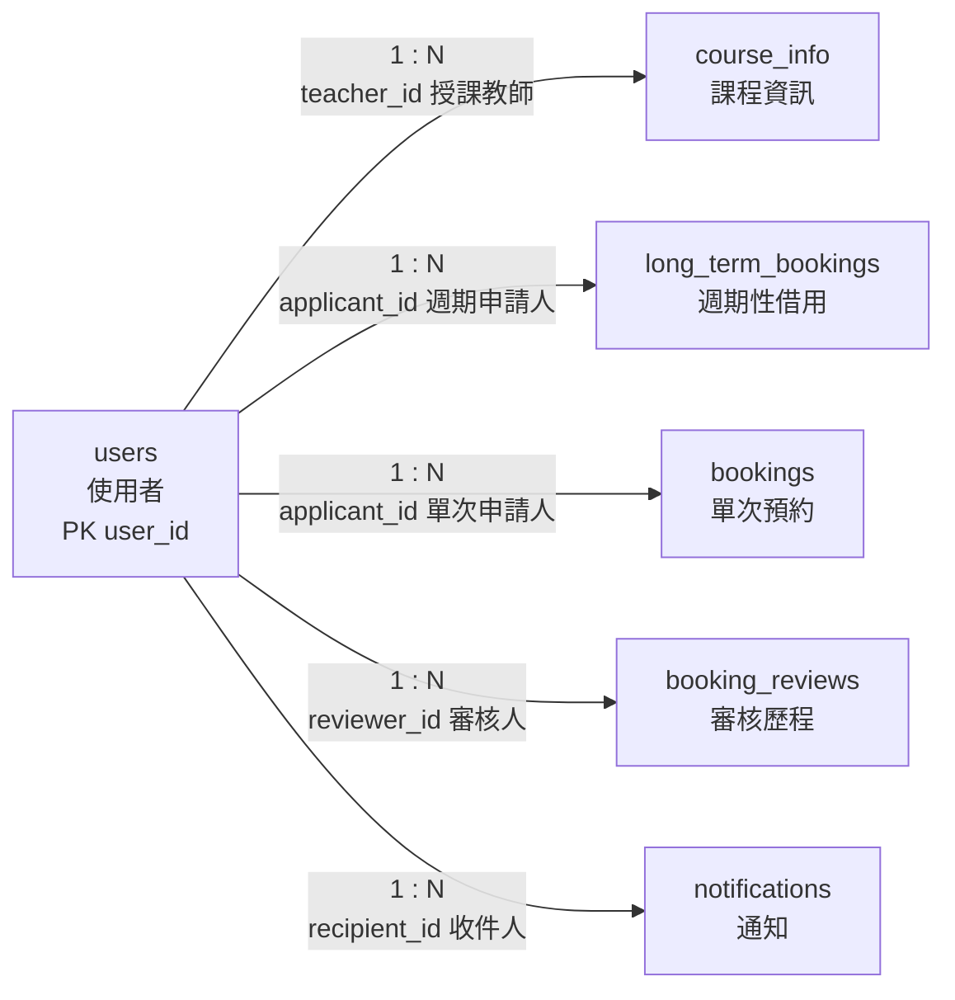

# 01. `users` 使用者

> [返回規格索引](資料表規格索引.md) | [返回專案總覽](../../README.md)

## 資料表用途

`users` 是全系統的身分主資料。課程授課教師、借用申請人、審核人員與通知收件人均透過外鍵參照本表，避免在交易資料中重複保存姓名、角色與電子郵件。

## 欄位規格與設計理由

| 欄位 | 型態 | 鍵值／預設 | 限制 | 系統用途 | 型態與限制理由 |
|---|---|---|---|---|---|
| `user_id` | `CHAR(8)` | PK | `NOT NULL`、帳號格式 `CHECK` | 使用者與 MariaDB 登入帳號的共同識別碼 | 學號及教職員帳號長度有上限，使用固定長度型態；主鍵確保每位使用者唯一。 |
| `username` | `VARCHAR(60)` | 無 | `NOT NULL` | 顯示申請人、教師及審核人姓名 | 姓名長度不固定，使用有上限的可變長度文字；業務流程必須能辨識使用者，因此不可為空。 |
| `email` | `VARCHAR(254)` | UK | `NOT NULL`、`UNIQUE` | 通知地址及帳號聯絡資料 | 電子郵件長度可變；唯一限制防止多個帳號共用同一地址而造成通知歸屬不明。 |
| `role` | `ENUM('student','teacher','admin')` | 無 | `NOT NULL` | 決定申請、查詢與管理權限 | 角色集合固定為三種，`ENUM` 可在資料庫層拒絕其他值。 |
| `department` | `VARCHAR(80)` | `NULL` | 可為空 | 所屬系所或行政單位 | 單位名稱長度不固定；外部或尚未分派單位的帳號可暫不填寫。 |

## 嚴格值域與正則表達式限制

以下正則表達式應同時用於前端表單與後端 API 驗證；已可由資料庫直接限制者，需同步保留於 MariaDB `CHECK`、`ENUM`、`UNIQUE` 或外鍵限制中。

- `user_id`：只允許學生八碼數字或教職員大寫英文字母加五至七碼數字。正則：`^([0-9]{8}|[A-Z][0-9]{5,7})$`。資料庫已以 `chk_users_id_format` 檢查此格式，範例包含 `41243149`、`B13005`、`E13006`。
- `username`：只允許中文、英文字母與姓名分隔符號，不允許數字、Email、表情符號或控制字元。正則：`^[\p{Han}A-Za-z·．・]{2,60}$`。此限制可避免把帳號、班級或無意義符號填入姓名欄位。
- `email`：必須為一般電子郵件格式，且全表唯一。正則：`^[A-Za-z0-9._%+-]+@[A-Za-z0-9.-]+\.[A-Za-z]{2,63}$`。資料庫以 `UNIQUE` 防止重複，後端需負責格式驗證。
- `role`：只能為 `student`、`teacher`、`admin`。正則：`^(student|teacher|admin)$`。資料庫以 `ENUM` 限制身份值域。
- `department`：可為 `NULL`；若填寫，只允許中文、英文字母、數字、空白、括號與校內單位常用字詞，長度二至八十字。正則：`^$|^[\p{Han}A-Za-z0-9（）()學院系所科中心處室組 -]{2,80}$`。此欄位不得填入私人備註或聯絡資訊。

## 關聯

| 關聯實體 | 關聯類型 | 對方外鍵 | 說明 | 使用範例 |
|---|---|---|---|---|
| `course_info` | `users 1:N course_info` | `course_info.teacher_id` -> `users.user_id` | 一位教師可教授多門課程。 | 教師 `B13005` 可對應資料庫系統課程。 |
| `long_term_bookings` | `users 1:N long_term_bookings` | `long_term_bookings.applicant_id` -> `users.user_id` | 一位使用者可提出多筆長期借用。 | `B13001` 可申請產學合作週會。 |
| `bookings` | `users 1:N bookings` | `bookings.applicant_id` -> `users.user_id` | 一位使用者可提出多筆單次預約。 | `41243149` 可申請 `BGC0508` 教室借用。 |
| `booking_reviews` | `users 1:N booking_reviews` | `booking_reviews.reviewer_id` -> `users.user_id` | 一位管理員可執行多次審核。 | 管理員 `E13006` 可留下多筆審核紀錄。 |
| `notifications` | `users 1:N notifications` | `notifications.recipient_id` -> `users.user_id` | 一位使用者可接收多則通知。 | `41243149` 可收到核准通知及長期借用通知。 |

## 局部實體關聯圖



所有連線均為必填外鍵關聯；角色是否符合教師或管理員身分，另由 Trigger 驗證。

## 其他邏輯規則

1. `course_info.teacher_id` 必須參照 `role = 'teacher'` 的使用者。
2. `booking_reviews.reviewer_id` 必須參照 `role = 'admin'` 的使用者。
3. 一般 MariaDB 帳號名稱必須與 `user_id` 相同，個人 View 才能正確過濾資料。
4. 刪除已被交易資料參照的使用者會被外鍵拒絕，以保留歷史紀錄。

## 對應 View

```sql
SELECT * FROM vw_users;
SHOW CREATE VIEW vw_users;
```

學生與教師只會看見自己的資料；管理員可看見全部使用者。

## 範例資料

| `user_id` | 姓名 | 角色 | 單位 |
|---|---|---|---|
| 41225244 | 劉哲瑋 | student | 電機工程系 |
| 41243149 | 廖章竹 | student | 資訊工程系 |
| 41243151 | 劉向榮 | student | 資訊工程系 |
| 41243154 | 蔡品辰 | student | 資訊工程系 |
| 41243161 | 羅冠穎 | student | 資訊工程系 |
| B13001 | 鄭錦聰 | teacher | 資訊工程系 |
| B13005 | 江季翰 | teacher | 資訊工程系 |
| B13007 | 林易泉 | teacher | 資訊工程系 |
| B13011 | 黃建宏 | teacher | 資訊工程系 |
| E13006 | 蔡明靜 | admin | 資訊工程系 |
| F10013 | 鐘佳純 | admin | 教務處 |
