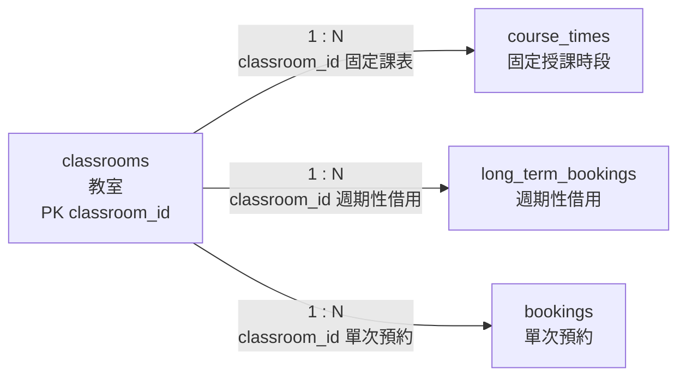

# 02. `classrooms` 教室

> [返回規格索引](資料表規格索引.md) | [返回專案總覽](../../README.md)

## 資料表用途

`classrooms` 保存可排課或借用的空間主資料。固定課表、週期性借用與單次預約均以 `classroom_id` 參照本表。

## 欄位規格與設計理由

| 欄位 | 型態 | 鍵值／預設 | 限制 | 系統用途 | 型態與限制理由 |
|---|---|---|---|---|---|
| `classroom_id` | `VARCHAR(10)` | PK | `NOT NULL`、代碼格式 `CHECK` | 教室、實驗室或會議室代碼 | `BGC0501`、`BRA0102`、`BCB0303` 長度不同，因此使用可變長度代碼；`chk_classrooms_id_format` 保證代碼符合正式格式。 |
| `classroom_name` | `VARCHAR(80)` | 無 | `NOT NULL`、名稱長度 `CHECK` | 顯示正式空間名稱 | 名稱長度不固定，且所有教室都必須有可辨識名稱；`chk_classrooms_name_length` 排除空白或過短名稱。 |
| `capacity` | `SMALLINT UNSIGNED` | 無 | `NOT NULL`、`CHECK (capacity BETWEEN 1 AND 1000)` | 表示合法容納人數 | 人數不得為負值，`SMALLINT` 已足以涵蓋一般校園空間；一至一千人可涵蓋校園教室容量並排除不合理輸入。 |
| `is_active` | `BOOLEAN` | `TRUE` | `NOT NULL`、布林檢查 | 控制是否開放新預約 | 只有啟用與停用兩種狀態；預設新教室為啟用，停用教室由 Trigger 阻擋新預約。 |

## 嚴格值域與正則表達式限制

以下規則用於限制管理員新增或修改教室主檔時的輸入值。

- `classroom_id`：採三碼大寫建物代碼加四碼樓層與教室號。正則：`^[A-Z]{3}[0-9]{4}$`。資料庫已以 `chk_classrooms_id_format` 檢查此格式；合法例：`BGC0501`、`BRA0102`；不接受 `bgc0501`、`BGC-501` 或只有中文名稱的代碼。
- `classroom_name`：只允許中文、英文字母、數字、空白、括號、頓號與連字號，長度二至八十字。正則：`^[\p{Han}A-Za-z0-9（）()、 -]{2,80}$`。資料庫以 `chk_classrooms_name_length` 檢查長度，完整字元集合由輸入層驗證。
- `capacity`：輸入格式必須為正整數，限制在一至一千人。正則：`^(?:[1-9][0-9]{0,2}|1000)$`。資料庫已以 `chk_classrooms_capacity` 禁止零、負數與超過一千人的不合理容量。
- `is_active`：只允許布林值。正則：`^(TRUE|FALSE|true|false|1|0)$`。資料庫以 `BOOLEAN` 與 `CHECK` 維持啟用或停用兩種狀態。

## 關聯

| 關聯實體 | 關聯類型 | 對方外鍵 | 說明 | 使用範例 |
|---|---|---|---|---|
| `course_times` | `classrooms 1:N course_times` | `course_times.classroom_id` -> `classrooms.classroom_id` | 一間教室可安排多筆不同星期或節次的固定課表。 | `BGC0513` 可安排資料庫系統與編譯程式時段。 |
| `long_term_bookings` | `classrooms 1:N long_term_bookings` | `long_term_bookings.classroom_id` -> `classrooms.classroom_id` | 一間教室可具有多筆週期性借用規則。 | `BGC0402` 可被多筆教師週期性借用申請使用。 |
| `bookings` | `classrooms 1:N bookings` | `bookings.classroom_id` -> `classrooms.classroom_id` | 一間教室可累積多筆不同日期的預約。 | `BGC0508` 可在不同日期被學生申請借用。 |

## 局部實體關聯圖



三條連線均為必填外鍵；教室停用時保留既有關聯資料，但不得接受新的待審核或已核准預約。

## 其他邏輯規則

1. `capacity` 必須大於零。
2. `is_active = FALSE` 時不得建立新的待審核或已核准預約。
3. 停用教室仍保留既有課表與歷史預約，避免刪除稽核資料。
4. 同一教室的已核准預約及固定課表不得發生節次重疊。

## 對應 View

```sql
SELECT * FROM vw_classrooms ORDER BY classroom_id;
```

一般使用者只會看見啟用教室；管理員可查看全部資料。

## 10 筆範例資料

| 代碼 | 名稱 | 容量 |
|---|---|---:|
| BGC0501 | 基本電學與證照實驗室 | 50 |
| BGC0513 | 生物資訊實驗室 | 51 |
| BGC0601 | 系統設計實驗室 | 52 |
| BGC0614 | 多功能教學實驗室 | 53 |
| BCB0303 | 資工科普通教室 | 40 |
| BCB0305 | 數位邏輯實驗室 | 35 |
| BRA0102 | 人工智慧創新實驗室 | 70 |
| BRA0201 | 智慧運算與資訊安全實驗室 | 60 |
| BGC0508 | 研討室 | 10 |
| BGC0402 | 會議室 | 20 |
