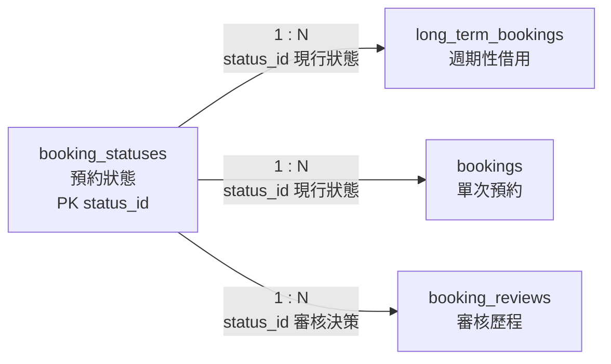

# 04. `booking_statuses` 預約狀態

> [返回規格索引](資料表規格索引.md) | [返回專案總覽](../../README.md)

## 資料表用途

`booking_statuses` 集中管理週期性借用、單次預約與審核歷程使用的狀態。狀態文字不直接重複寫入交易資料，所有交易只保存 `status_id`。

## 欄位規格與設計理由

| 欄位 | 型態 | 鍵值／預設 | 限制 | 系統用途 | 型態與限制理由 |
|---|---|---|---|---|---|
| `status_id` | `TINYINT UNSIGNED` | PK | `NOT NULL`、狀態編號 `CHECK` | 狀態外鍵識別碼 | 狀態數量有限且不得為負值，小型無號整數足以表示；`chk_statuses_id_range` 限制為 1 至 10。 |
| `status_code` | `VARCHAR(32)` | UK | `NOT NULL`、`UNIQUE`、十種代碼 `CHECK` | 程式流程與 API 使用的穩定代碼 | `draft` 與 `resubmission_required` 長度不同，因此使用可變長度文字；`chk_statuses_code` 以大小寫敏感正則阻擋未定義代碼。 |
| `status_name` | `VARCHAR(20)` | 無 | `NOT NULL`、名稱長度 `CHECK` | 介面顯示的中文名稱 | 顯示名稱長度可變且每個狀態都必須具有可讀名稱；`chk_statuses_name_length` 排除空白或過長名稱。 |

## 嚴格值域與正則表達式限制

狀態主檔影響預約流程判斷，僅管理員可維護，且不接受任意自訂狀態。

- `status_id`：目前固定一至十。正則：`^(?:[1-9]|10)$`。資料庫已以 `chk_statuses_id_range` 限制，不得使用零、負數、小數或跳號文字。
- `status_code`：只能為十個已定義流程代碼。正則：`^(draft|pending|under_review|approved|rejected|canceled|expired|completed|suspended|resubmission_required)$`。資料庫已以 `chk_statuses_code` 與 `UNIQUE` 限制。
- `status_name`：只允許中文、英文字母與數字，長度二至二十字。正則：`^[\p{Han}A-Za-z0-9]{2,20}$`。資料庫以 `chk_statuses_name_length` 檢查長度，完整字元集合由輸入層驗證。

## 為何不使用 ENUM

本表本身即為正規化的狀態 Domain。若 `status_code` 再使用 `ENUM`，每次新增狀態都必須同時修改資料表型態與狀態資料，造成重複維護。因此採 `VARCHAR(32)` 配合 `UNIQUE` 與 `CHECK`，由本表統一管理狀態。

## 關聯

| 關聯實體 | 關聯類型 | 對方外鍵 | 說明 | 使用範例 |
|---|---|---|---|---|
| `long_term_bookings` | `booking_statuses 1:N long_term_bookings` | `long_term_bookings.status_id` -> `booking_statuses.status_id` | 一種狀態可套用於多筆長期借用。 | `approved` 可代表長期借用已核准。 |
| `bookings` | `booking_statuses 1:N bookings` | `bookings.status_id` -> `booking_statuses.status_id` | 一種狀態可套用於多筆單次預約。 | `pending` 可代表單次預約待審核。 |
| `booking_reviews` | `booking_statuses 1:N booking_reviews` | `booking_reviews.status_id` -> `booking_statuses.status_id` | 一種狀態可記錄於多筆審核歷程。 | `rejected` 可記錄管理員拒絕原因。 |

## 局部實體關聯圖



所有連線均為必填外鍵。交易資料保存現行狀態，`booking_reviews` 則保存每次審核決策的歷程狀態。

## 其他邏輯規則

1. `approved` 表示教室已被占用，寫入時必須執行衝突檢查。
2. `draft` 尚未進入審核流程。
3. `pending` 與 `under_review` 尚未取得教室使用權。
4. `completed`、`rejected`、`canceled`、`expired` 為終止或結案狀態。
5. `suspended` 與 `resubmission_required` 表示流程暫停，需後續行政處理。

## 對應 View

```sql
SELECT * FROM vw_booking_statuses ORDER BY status_id;
```

## 10 筆範例資料

| ID | 代碼 | 中文名稱 |
|---:|---|---|
| 1 | pending | 待審核 |
| 2 | approved | 已核准 |
| 3 | rejected | 已拒絕 |
| 4 | canceled | 已取消 |
| 5 | draft | 草稿 |
| 6 | under_review | 審核中 |
| 7 | expired | 已逾期 |
| 8 | completed | 已完成 |
| 9 | suspended | 已暫停 |
| 10 | resubmission_required | 待補件 |
