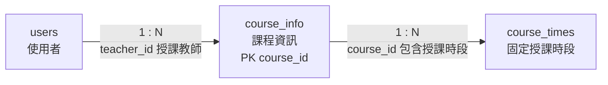

# 05. `course_info` 課程資訊

> [返回規格索引](資料表規格索引.md) | [返回專案總覽](../../README.md)

## 資料表用途

`course_info` 保存每學期課程的識別碼、學年度、學期、名稱與授課教師。固定授課星期、教室與節次另存於 `course_times`，使一門課程可具有多個授課時段。

## 欄位規格與設計理由

| 欄位 | 型態 | 鍵值／預設 | 限制 | 系統用途 | 型態與限制理由 |
|---|---|---|---|---|---|
| `course_id` | `VARCHAR(20)` | PK | `NOT NULL`、課程代碼 `CHECK` | 課程唯一代碼 | 目前課程代碼採八位數字；保留 `VARCHAR(20)` 可支援校務系統代碼擴充，並以 `chk_course_info_id_format` 約束現行格式。 |
| `academic_year` | `SMALLINT UNSIGNED` | 無 | `NOT NULL`、`CHECK 1..999` | 民國學年度 | 值如 `115` 不是西元年份，因此不使用 MariaDB `YEAR`；無號小整數可禁止負值。 |
| `semester` | `TINYINT UNSIGNED` | 無 | `NOT NULL`、`CHECK IN (1,2)` | 第一或第二學期 | 值域只有 1、2，使用小型無號整數並明確限制。 |
| `course_name` | `VARCHAR(120)` | 無 | `NOT NULL`、名稱長度 `CHECK` | 正式課程名稱 | 名稱長度可變且不可缺少；`chk_course_info_name_length` 排除空白或過短名稱。 |
| `teacher_id` | `CHAR(8)` | FK | `NOT NULL` | 授課教師 | 與 `users.user_id` 使用相同 Domain；外鍵保證帳號存在，Trigger 進一步驗證教師角色。 |

## 嚴格值域與正則表達式限制

課程資料來源應與校務課程代碼一致，避免同一課程以多種格式進入系統。

- `course_id`：目前採八位數字課程代碼。正則：`^[0-9]{8}$`。資料庫已以 `chk_course_info_id_format` 檢查此格式，不接受空白、中文、連字號或重複代碼。
- `academic_year`：採民國學年度，一至三位正整數。正則：`^[1-9][0-9]{0,2}$`。資料庫以 `CHECK (academic_year BETWEEN 1 AND 999)` 限制，不使用西元日期格式。
- `semester`：只能輸入 `1` 或 `2`。正則：`^[12]$`。資料庫以 `CHECK (semester IN (1, 2))` 限制。
- `course_name`：只允許中文、英文字母、數字、空白、括號、頓號、冒號、連字號與斜線，長度二至一百二十字。正則：`^[\p{Han}A-Za-z0-9（）()、:：/\- ]{2,120}$`。資料庫以 `chk_course_info_name_length` 檢查長度，完整字元集合由輸入層驗證。
- `teacher_id`：使用 `users.user_id` 相同格式。正則：`^([0-9]{8}|[a-z][0-9]{5,7})$`，並必須參照 `role = 'teacher'` 的使用者。格式由使用者主檔限制，教師身份由 Trigger 驗證。

## 關聯

| 關聯實體 | 關聯類型 | 對方外鍵 | 說明 | 使用範例 |
|---|---|---|---|---|
| `users` | `users 1:N course_info` | `course_info.teacher_id` -> `users.user_id` | 一位教師可教授多門課程。 | 教師 `b13005` 可對應資料庫系統課程。 |
| `course_times` | `course_info 1:N course_times` | `course_times.course_id` -> `course_info.course_id` | 一門課程可安排多個固定授課時段。 | 編譯程式可同時有週四與週五課表。 |

## 局部實體關聯圖



兩條連線均為必填外鍵；`teacher_id` 除了參照既有使用者，還必須通過教師角色驗證。

## 其他邏輯規則

1. `teacher_id` 必須參照 `role = 'teacher'` 的使用者。
2. 教師資料庫帳號只能建立或修改指派給自己的課程。
3. 課程刪除前必須先處理相關固定課表，以避免破壞參照完整性。
4. 學年度採民國年，所有資料輸入與報表必須維持相同表示方式。

## 對應 View

```sql
SELECT * FROM vw_course_info ORDER BY course_id;
```

此 View 只授權教師與管理員查詢。

## 10 筆範例資料

| 課程代碼 | 課程名稱 | 學年度／學期 | 教師 |
|---|---|---|---|
| 11422012 | 資料庫系統 | 114／2 | b13005 |
| 11422016 | 人工智慧 | 114／2 | b13001 |
| 11422009 | 微處理機實習 | 114／2 | b13014 |
| 11422011 | 編譯程式 | 114／2 | b13021 |
| 11422013 | 系統分析與設計 | 114／2 | b13037 |
| 11422015 | 軟體工程 | 114／2 | b13022 |
| 11422014 | 科技英文 | 114／2 | b13028 |
| 11422018 | 可規劃邏輯設計實務 | 114／2 | b13035 |
| 11412064 | JAVA程式設計(一) | 114／1 | b13023 |
| 11412083 | 微處理機 | 114／1 | b13012 |
