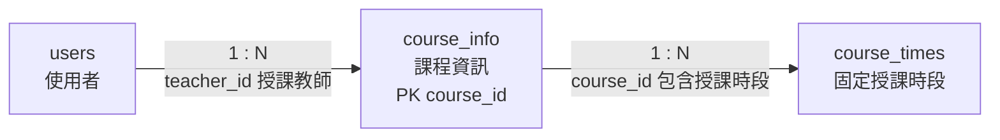

# 05. `course_info` 課程資訊

> [返回規格索引](資料表規格索引.md) | [返回專案總覽](../../README.md)

## 資料表用途

`course_info` 保存每學期課程的識別碼、學年度、學期、名稱與授課教師。固定授課星期、教室與節次另存於 `course_times`，使一門課程可具有多個授課時段。

## 欄位規格與設計理由

| 欄位 | 型態 | 鍵值／預設 | 限制 | 系統用途 | 型態與限制理由 |
|---|---|---|---|---|---|
| `course_id` | `VARCHAR(20)` | PK | `NOT NULL` | 課程唯一代碼 | 課程代碼由系所縮寫、類別及流水號組成，長度可變；主鍵確保課程唯一。 |
| `academic_year` | `SMALLINT UNSIGNED` | 無 | `NOT NULL`、`CHECK 1..999` | 民國學年度 | 值如 `115` 不是西元年份，因此不使用 MariaDB `YEAR`；無號小整數可禁止負值。 |
| `semester` | `TINYINT UNSIGNED` | 無 | `NOT NULL`、`CHECK IN (1,2)` | 第一或第二學期 | 值域只有 1、2，使用小型無號整數並明確限制。 |
| `course_name` | `VARCHAR(120)` | 無 | `NOT NULL` | 正式課程名稱 | 名稱長度可變且不可缺少。 |
| `teacher_id` | `CHAR(8)` | FK | `NOT NULL` | 授課教師 | 與 `users.user_id` 使用相同 Domain；外鍵保證帳號存在，Trigger 進一步驗證教師角色。 |

## 關聯

| 關聯實體 | 關聯類型 | 對方外鍵 | 說明 | 使用範例 |
|---|---|---|---|---|
| `users` | `users 1:N course_info` | `course_info.teacher_id` -> `users.user_id` | 一位教師可教授多門課程。 | 教師 `B13005` 可對應資料庫系統課程。 |
| `course_times` | `course_info 1:N course_times` | `course_times.course_id` -> `course_info.course_id` | 一門課程可安排多個固定授課時段。 | 編譯程式可同時有週四與週五課表。 |

## 局部實體關聯圖



兩條連線均為必填外鍵；`teacher_id` 除了參照既有使用者，還必須通過教師角色驗證。

## 其他邏輯規則

1. `teacher_id` 必須參照 `role = 'teacher'` 的使用者。
2. 教師資料庫帳號只能建立或修改指派給自己的課程。
3. 課程刪除前必須先處理相關固定課表，以避免破壞參照完整性。
4. 學年度採民國年，所有資料輸入與報表必須維持相同表示方式。

## 對應 View

```sql
SELECT * FROM vw_course_info ORDER BY course_id;
```

此 View 只授權教師與管理員查詢。

## 10 筆範例資料

| 課程代碼 | 課程名稱 | 學年度／學期 | 教師 |
|---|---|---|---|
| 11422012 | 資料庫系統 | 114／2 | B13005 |
| 11422016 | 人工智慧 | 114／2 | B13001 |
| 11422009 | 微處理機實習 | 114／2 | B13014 |
| 11422011 | 編譯程式 | 114／2 | B13021 |
| 11422013 | 系統分析與設計 | 114／2 | B13037 |
| 11422015 | 軟體工程 | 114／2 | B13022 |
| 11422014 | 科技英文 | 114／2 | B13028 |
| 11422018 | 可規劃邏輯設計實務 | 114／2 | B13035 |
| 11412064 | JAVA程式設計(一) | 114／1 | B13023 |
| 11412083 | 微處理機 | 114／1 | B13012 |
