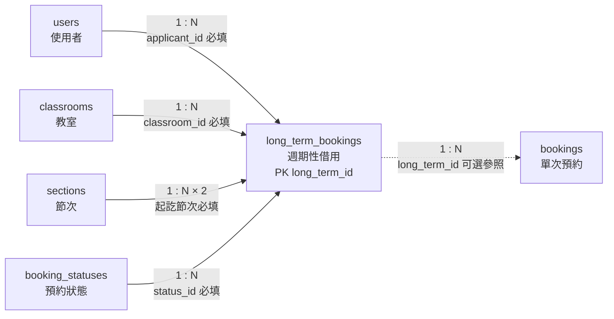

# 07. `long_term_bookings` 週期性借用

> [返回規格索引](資料表規格索引.md) | [返回專案總覽](../../README.md)

## 資料表用途

`long_term_bookings` 保存指定日期範圍內、每週固定一天與固定節次的借用規則。它是週期性借用的主紀錄；每個實際使用日期仍由 `bookings` 保存，以便逐日執行衝突與審核管理。

## 欄位規格與設計理由

| 欄位 | 型態 | 鍵值／預設 | 限制 | 系統用途 | 型態與限制理由 |
|---|---|---|---|---|---|
| `long_term_id` | `BIGINT UNSIGNED` | PK、`AUTO_INCREMENT` | `NOT NULL` | 週期性借用識別碼 | 交易資料會長期累積，使用大型無號代理鍵。 |
| `applicant_id` | `CHAR(8)` | FK | `NOT NULL` | 申請教師 | 與使用者主鍵型態一致；外鍵確保申請人存在，Trigger 限制教師角色。 |
| `classroom_id` | `VARCHAR(10)` | FK | `NOT NULL` | 固定借用教室 | 參照教室主資料，避免保存無效代碼。 |
| `start_date` | `DATE` | 無 | `NOT NULL` | 規則生效的第一個日曆日期 | 不包含時刻且不應受時區影響，因此使用 `DATE`。 |
| `end_date` | `DATE` | 無 | `NOT NULL`、不得早於開始日期 | 規則生效的最後一個日曆日期 | 與開始日期使用相同 Domain，日期範圍由 `CHECK` 保護。 |
| `day_of_week` | `TINYINT UNSIGNED` | 無 | `NOT NULL`、`CHECK 1..7` | 每週固定使用日 | 小範圍非負值可直接對應星期。 |
| `start_section_id` | `TINYINT UNSIGNED` | FK | `NOT NULL` | 每次借用開始節次 | 參照統一節次主資料。 |
| `end_section_id` | `TINYINT UNSIGNED` | FK | `NOT NULL`、不得早於開始節次 | 每次借用結束節次 | 以範圍檢查阻止反向節次。 |
| `reason` | `TEXT` | 無 | `NOT NULL` | 週期性借用用途 | 用途說明長度差異大，不以任意短字數截斷；申請必須提出理由。 |
| `status_id` | `TINYINT UNSIGNED` | FK | `NOT NULL` | 現行處理狀態 | 狀態由 `booking_statuses` 集中管理。 |
| `created_at` | `TIMESTAMP(6)` | `CURRENT_TIMESTAMP(6)` | `NOT NULL` | 建立事件時間 | 事件時間需要時區轉換與高解析度排序，因此保留六位小數秒。 |

## 關聯

| 關聯實體 | 關聯類型 | 對方外鍵 | 說明 | 使用範例 |
|---|---|---|---|---|
| `users` | `users 1:N long_term_bookings` | `long_term_bookings.applicant_id` -> `users.user_id` | 一位使用者可提出多筆長期借用。 | `B13001` 可申請產學合作週會。 |
| `classrooms` | `classrooms 1:N long_term_bookings` | `long_term_bookings.classroom_id` -> `classrooms.classroom_id` | 一間教室可被多筆週期性借用申請使用。 | `BGC0402` 可被多位教師申請固定週會。 |
| `sections` | `sections 1:N long_term_bookings` | `long_term_bookings.start_section_id` -> `sections.section_id` | 一個節次可作為多筆週期性借用的開始節次。 | 第 5 節可作為專題小組定期會議開始節次。 |
| `sections` | `sections 1:N long_term_bookings` | `long_term_bookings.end_section_id` -> `sections.section_id` | 一個節次可作為多筆週期性借用的結束節次。 | 第 6 節可作為專題小組定期會議結束節次。 |
| `booking_statuses` | `booking_statuses 1:N long_term_bookings` | `long_term_bookings.status_id` -> `booking_statuses.status_id` | 一種狀態可套用於多筆長期借用。 | `approved` 可代表長期借用已核准。 |
| `bookings` | `long_term_bookings 1:N bookings` | `bookings.long_term_id` -> `long_term_bookings.long_term_id` | 一筆長期借用可展開為多筆單次預約；此欄位可為空。 | 長期借用 `1` 可展開為 `2026-06-12` 的單次預約。 |

## 局部實體關聯圖



四條實線為週期性借用的必填外鍵；通往 `bookings` 的虛線表示一般單次預約不需要週期性來源。

## 其他邏輯規則

1. 學生不能建立週期性借用。
2. 教師只能建立自己的 `pending` 資料，並只能修改或取消自己的待審核資料。
3. 管理員可處理全部狀態與申請人資料。
4. `start_date <= end_date`。
5. `start_section_id <= end_section_id`。
6. 展開為單次預約時，每個實際日期都必須重新接受固定課表與已核准預約衝突檢查。

## 對應 View

```sql
SELECT * FROM vw_long_term_bookings ORDER BY created_at DESC;
```

教師只會看見自己的資料；管理員可看見全部。

## 10 筆範例資料

| ID | 申請人 | 教室 | 星期／節次 | 狀態 |
|---:|---|---|---|---|
| 1 | 41243149 | BGC0508 | 週五 5–6 | approved |
| 2 | 41243154 | BGC0508 | 週三 8–9 | approved |
| 3 | B13027 | BGC0601 | 週一 9–10 | approved |
| 4 | 41243151 | BGC0508 | 週三 5–5 | approved |
| 5 | B13014 | BGC0402 | 週五 8–8 | approved |
| 6 | B13020 | BGC0402 | 週三 8–9 | pending |
| 7 | B13027 | BGC0402 | 週五 2–3 | rejected |
| 8 | B13035 | BGC0402 | 週四 5–6 | canceled |
| 9 | B13001 | BGC0402 | 週二 1–2 | approved |
| 10 | B13007 | BGC0402 | 週一 5–6 | pending |
