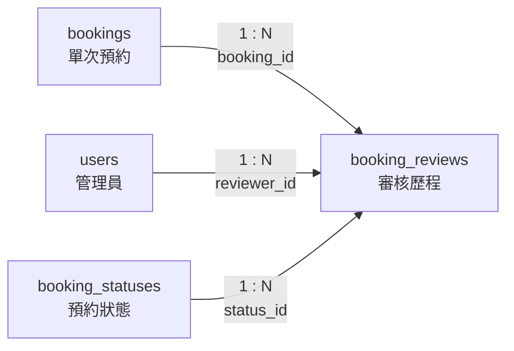

# 09. `booking_reviews` 審核歷程

> [返回規格索引](資料表規格索引.md) | [返回專案總覽](../../README.md)

## 資料表用途

`booking_reviews` 保存每一次預約審核決策。資料採新增歷程方式記錄，不覆寫先前結果，因此可追查處理人員、處理狀態、審核意見及決策時間。

## 欄位規格與設計理由

| 欄位 | 型態 | 鍵值／預設 | 限制 | 系統用途 | 型態與限制理由 |
|---|---|---|---|---|---|
| `review_id` | `BIGINT UNSIGNED` | PK、`AUTO_INCREMENT` | `NOT NULL` | 審核歷程識別碼 | 審核紀錄會持續累積，使用大型無號代理鍵可提供充足編號範圍。 |
| `booking_id` | `BIGINT UNSIGNED` | FK | `NOT NULL` | 指定被審核的單次預約 | 型態與 `bookings.booking_id` 一致；外鍵阻止審核紀錄參照不存在的預約。 |
| `reviewer_id` | `CHAR(8)` | FK | `NOT NULL` | 記錄執行審核的管理員 | 與使用者主鍵型態一致；外鍵確保帳號存在，Trigger 進一步限制為管理員角色。 |
| `status_id` | `TINYINT UNSIGNED` | FK | `NOT NULL` | 保存本次審核決策 | 狀態數量有限且不允許負值；外鍵使決策只能採用正式狀態主資料。 |
| `comment` | `TEXT` | `NULL` | 可為空 | 保存核准、拒絕、補件或暫停原因 | 審核說明長度不固定；部分純狀態登錄不需要附註，因此允許 `NULL`。 |
| `reviewed_at` | `TIMESTAMP(6)` | `CURRENT_TIMESTAMP(6)` | `NOT NULL` | 保存審核事件發生時間 | 記錄日期、時分秒及六位小數秒，並依 MariaDB 連線時區轉換，適合稽核與精確排序。 |

## 嚴格值域與正則表達式限制

審核紀錄屬於稽核資料，需保證審核對象、審核者、狀態與意見都可追溯。

- `review_id`：系統自動產生，不提供使用者輸入；若用於查詢條件，只接受正整數。正則：`^[1-9][0-9]{0,18}$`。
- `booking_id`：必須為已存在預約的正整數。正則：`^[1-9][0-9]{0,18}$`，並以外鍵參照 `bookings.booking_id`。
- `reviewer_id`：使用 `users.user_id` 相同格式。正則：`^([0-9]{8}|[a-z][0-9]{5,7})$`，且必須參照 `role = 'admin'` 的使用者。管理員身份由 Trigger 驗證。
- `status_id`：必須為一至十的狀態主檔代碼。正則：`^(?:[1-9]|10)$`，並以外鍵參照 `booking_statuses.status_id`。
- `comment`：可為 `NULL`；若填寫，必須為一至五百字的正式說明，允許中文、英文字母、數字、空白與常用標點。正則：`^$|^[\p{Han}A-Za-z0-9，。；：、,.!?()（）《》「」\s\-_]{1,500}$`。資料庫以 `chk_reviews_comment_length` 檢查長度，完整字元集合由輸入層驗證；不得輸入辱罵、私人聯絡資訊、HTML 或程式碼。
- `reviewed_at`：由資料庫自動產生，不接受使用者輸入；若用於查詢條件，格式為 `YYYY-MM-DD HH:MM:SS[.ffffff]`。正則：`^20\d{2}-(0[1-9]|1[0-2])-(0[1-9]|[12]\d|3[01]) ([01]\d|2[0-3]):[0-5]\d:[0-5]\d(?:\.\d{1,6})?$`。

## 關聯

| 關聯實體 | 關聯類型 | 對方外鍵 | 說明 | 使用範例 |
|---|---|---|---|---|
| `bookings` | `bookings 1:N booking_reviews` | `booking_reviews.booking_id` -> `bookings.booking_id` | 一筆預約可具有多次審核歷程；每筆審核只能屬於一筆預約。 | 預約 `3` 可留下場勘核准紀錄。 |
| `users` | `users 1:N booking_reviews` | `booking_reviews.reviewer_id` -> `users.user_id` | 一位管理員可執行多次審核；每筆審核只能由一位管理員執行。 | 管理員 `e13006` 可留下多筆審核紀錄。 |
| `booking_statuses` | `booking_statuses 1:N booking_reviews` | `booking_reviews.status_id` -> `booking_statuses.status_id` | 一種狀態可被多筆審核採用；每筆審核只保存一個決策狀態。 | `approved` 可代表本次審核決策為核准。 |

## 局部實體關聯圖



三條連線均為必填外鍵；`reviewer_id` 還必須通過管理員角色驗證。

## 其他邏輯規則

1. `trg_reviews_validate_insert` 與 `trg_reviews_validate_update` 驗證 `reviewer_id` 必須參照 `admin` 角色。
2. 同一筆預約可以保存多次審核，以呈現收件、審核中、補件、核准或拒絕等處理歷程。
3. 新的決策以新增資料表示，不得透過覆寫舊資料取代既有歷程。
4. `comment` 應保存可供申請人理解的正式處理依據；若狀態本身已完整表達結果，才可留空。
5. 預約現行狀態保存於 `bookings.status_id`；本表負責歷程稽核，兩者用途不同。

## 對應 View

```sql
SELECT *
FROM vw_booking_reviews
ORDER BY reviewed_at DESC;

SHOW CREATE VIEW vw_booking_reviews;
```

一般申請人只能查看與自己預約相關的審核歷程；管理員可查看全部資料。

## 10 筆範例資料

| ID | 預約 ID | 審核人 | 狀態 | 審核摘要 |
|---:|---:|---|---|---|
| 1 | 1 | e13006 | approved | 時段可使用，核准借用 |
| 2 | 2 | e13006 | approved | 核准，請至系辦拿取鑰匙 |
| 3 | 3 | f10013 | approved | 大型活動場勘核准 |
| 4 | 4 | e13006 | approved | 確認未撞到正課與常規實驗 |
| 5 | 5 | e13006 | approved | 長期借用計畫內自動核准 |
| 6 | 6 | e13006 | pending | 尚在評估人數 |
| 7 | 7 | e13006 | rejected | 定期儀器維護，不開放 |
| 8 | 8 | e13006 | canceled | 申請人已自行取消 |
| 9 | 9 | f10013 | approved | 特殊考場調度核可 |
| 10 | 10 | e13006 | pending | 等待簽核同意書 |
