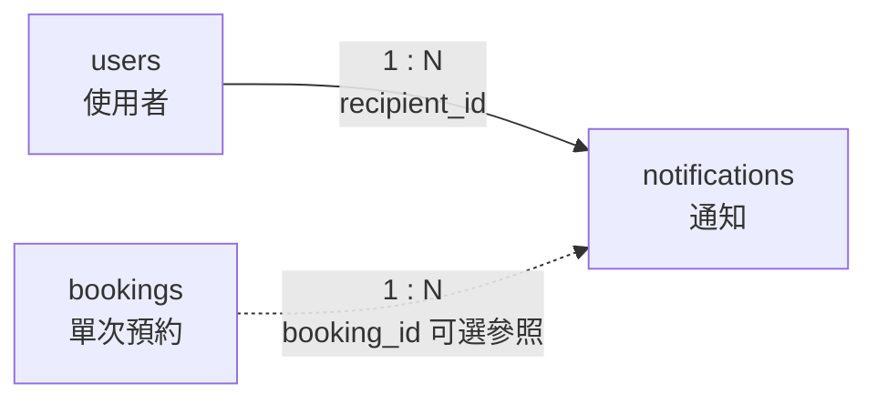

# 10. `notifications` 通知

> [返回規格索引](資料表規格索引.md) | [返回專案總覽](../../README.md)

## 資料表用途

`notifications` 保存系統傳送給使用者的通知內容與讀取狀態。通知可關聯特定預約，也可作為不隸屬任何預約的一般系統公告。

## 欄位規格與設計理由

| 欄位 | 型態 | 鍵值／預設 | 限制 | 系統用途 | 型態與限制理由 |
|---|---|---|---|---|---|
| `notification_id` | `BIGINT UNSIGNED` | PK、`AUTO_INCREMENT` | `NOT NULL` | 通知識別碼 | 通知量會長期累積，使用大型無號代理鍵避免編號範圍不足。 |
| `recipient_id` | `CHAR(8)` | FK | `NOT NULL` | 指定通知收件人 | 與使用者主鍵型態一致；外鍵確保通知只傳送給已登錄使用者。 |
| `booking_id` | `BIGINT UNSIGNED` | FK、`NULL` | 可為空 | 選擇性關聯單次預約 | 預約審核通知需要關聯案件；一般公告沒有預約來源，因此允許 `NULL`。 |
| `message` | `TEXT` | 無 | `NOT NULL` | 保存完整通知內容 | 通知長度不固定，且每筆通知必須具有可讀內容。 |
| `is_read` | `BOOLEAN` | `FALSE` | `NOT NULL`、值域檢查 | 表示使用者是否已閱讀 | 真偽狀態只需兩種值；預設未讀可確保新通知會出現在未讀清單。 |
| `created_at` | `TIMESTAMP(6)` | `CURRENT_TIMESTAMP(6)` | `NOT NULL` | 保存通知建立事件時間 | 記錄日期、時分秒及六位小數秒，並依 MariaDB 連線時區轉換，適合排序及追蹤傳送時間。 |

## 嚴格值域與正則表達式限制

通知資料直接顯示給使用者，必須避免空訊息、程式碼片段或錯誤收件人進入資料庫。

- `notification_id`：系統自動產生，不提供使用者輸入；若用於查詢條件，只接受正整數。正則：`^[1-9][0-9]{0,18}$`。
- `recipient_id`：使用 `users.user_id` 相同格式。正則：`^([0-9]{8}|[A-Z][0-9]{5,7})$`，並以外鍵參照已存在使用者。
- `booking_id`：可為 `NULL`；若填寫，只接受正整數。正則：`^$|^[1-9][0-9]{0,18}$`，並以外鍵參照 `bookings.booking_id`。
- `message`：必須為五至五百字，允許中文、英文字母、數字、空白與常用標點。正則：`^[\p{Han}A-Za-z0-9，。；：、,.!?()（）《》「」\s\-_]{5,500}$`。不得輸入 HTML、JavaScript、URL 追蹤碼或只有空白的訊息。
- `is_read`：只允許布林值。正則：`^(TRUE|FALSE|true|false|1|0)$`。資料庫以 `BOOLEAN` 與 `CHECK` 維持已讀或未讀兩種狀態。
- `created_at`：由資料庫自動產生，不接受使用者輸入；若用於查詢條件，格式為 `YYYY-MM-DD HH:MM:SS[.ffffff]`。正則：`^20\d{2}-(0[1-9]|1[0-2])-(0[1-9]|[12]\d|3[01]) ([01]\d|2[0-3]):[0-5]\d:[0-5]\d(?:\.\d{1,6})?$`。

## 關聯

| 關聯實體 | 關聯類型 | 對方外鍵 | 說明 | 使用範例 |
|---|---|---|---|---|
| `users` | `users 1:N notifications` | `notifications.recipient_id` -> `users.user_id` | 一位使用者可收到多筆通知；每筆通知必須具有一位收件人。 | `41243149` 可收到核准通知及長期借用通知。 |
| `bookings` | `bookings 1:N notifications` | `notifications.booking_id` -> `bookings.booking_id` | 一筆預約可產生多筆通知；一般公告可不參照預約。 | 預約 `3` 可產生 `BRA0102` 場勘核准通知。 |

## 局部實體關聯圖



收件人關聯為必填外鍵；預約關聯使用虛線，表示一般系統公告可不參照單次預約。

## 其他邏輯規則

1. 新增通知時 `is_read` 預設為 `FALSE`，表示尚未閱讀。
2. 學生與教師只能透過 `vw_notifications` 查看自己的通知，並且只能修改自己的 `is_read`。
3. 管理員可建立與管理通知，但不得使用一般帳號 View 讀取其他人的個人通知。
4. `booking_id` 為 `NULL` 時代表一般公告；非空值時必須參照已存在的預約。
5. `idx_notifications_recipient_read` 依收件人及讀取狀態建立複合索引，用於快速取得個人未讀通知。

## 對應 View

```sql
SELECT *
FROM vw_notifications
ORDER BY created_at DESC;

UPDATE vw_notifications
SET is_read = TRUE
WHERE notification_id = 3;

SHOW CREATE VIEW vw_notifications;
```

View 依 MariaDB 登入帳號限制資料列；一般使用者只能更新 `is_read` 欄位。

## 10 筆範例資料

| ID | 收件人 | 預約 ID | 已讀 | 通知摘要 |
|---:|---|---:|---|---|
| 1 | 41243149 | 1 | 否 | 申請已核准 |
| 2 | 41243154 | 2 | 是 | 申請已核准 |
| 3 | B13001 | 3 | 否 | 教室場勘已核准 |
| 4 | 41243151 | 4 | 否 | 申請已核准 |
| 5 | 41243149 | 5 | 是 | 長期借用派發核准 |
| 6 | 41243161 | 6 | 否 | 目前待審核 |
| 7 | B13005 | 7 | 是 | 申請已被拒絕 |
| 8 | 41243154 | 8 | 是 | 案件已取消 |
| 9 | B13023 | 9 | 否 | 加開考場已核准 |
| 10 | 41243151 | 10 | 否 | 目前待審核 |
