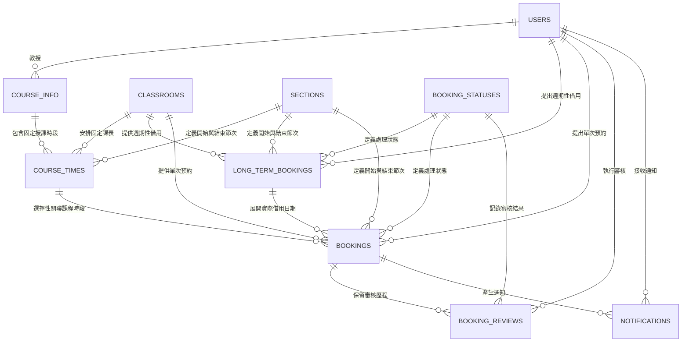

# 教室租用系統：專案與資料庫 Schema 完整說明

文件版本：`6.0`

適用資料庫：`MariaDB 11.4+`

資料庫名稱：`classroom_rental`

本文件為教室租用系統資料庫專案的主要入口，完整整合系統需求、應用情境、實體關聯圖、MariaDB Schema、完整性限制、資料型態依據、角色權限、View、SQL 範例、測試資料、驗證結果與參考資料。

## 目錄

- [文件導覽](#文件導覽)
- [小組成員](#小組成員)
- [題目與應用情境](#題目與應用情境)
- [系統需求說明](#系統需求說明)
- [身分與權限](#身分與權限)
- [ER Diagram](#er-diagram)
- [完整 DB Schema 架構](#完整-db-schema-架構)
- [各實體與資料表設計](#各實體與資料表設計)
- [其他邏輯規則與 Trigger](#其他邏輯規則與-trigger)
- [索引設計](#索引設計)
- [SQL：概念層到關聯式 Schema](#sql概念層到關聯式-schema)
- [View Schema 與呼叫](#view-schema-與呼叫)
- [範例資料](#範例資料)
- [專案結構](#專案結構)
- [執行方式](#執行方式)
- [驗證結果](#驗證結果)
- [參考資料](#參考資料)

## 文件導覽

| 文件或資料夾 | 內容 |
|---|---|
| [完整資料庫 Schema SQL](資料庫/完整資料庫Schema.sql) | 建立資料庫、10 張資料表、完整性限制、Trigger、索引、View 與 Role。 |
| [範例資料 SQL](資料庫/範例資料.sql) | 對每張資料表建立 10 筆互相一致的資料。 |
| [查詢與 View 範例](資料庫/查詢與View範例.sql) | 概念層關聯查詢、10 個 View 呼叫及 `SHOW CREATE VIEW`。 |
| [完整 Schema 架構與說明](文件/資料庫設計/完整資料庫Schema架構與說明.md) | 說明正規化、型態、限制、Trigger、索引、View 與角色權限。 |
| [資料表規格索引](文件/資料表規格/資料表規格索引.md) | 10 張資料表的用途、逐欄型態理由、關聯、其他邏輯規則與範例。 |
| [簡要 ER 圖](文件/實體關聯圖/ER_Diagram.md) | 使用明確 `1:N` 標示的 Mermaid 關聯圖。 |
| [詳細 ER 圖](文件/實體關聯圖/ER_Diagram_Detailed.md) | 列出完整欄位、鍵值與關聯基數。 |
| [diagrams.net 原始檔](文件/實體關聯圖/ER_Diagram_Detailed.drawio) | 可於 diagrams.net 開啟及編輯的完整圖面。 |
| [驗證說明](文件/驗證/驗證說明.md) | MariaDB 11.4.12 執行結果、物件數量、資料筆數與權限測試。 |
| [附件](附件/) | 期中報告、期末簡報及課程指定參考資料。 |

## 小組成員

| 學號 | 班級 | 姓名 |
|---|---|---|
| 41243149 | 四資工三甲 | 廖章竹 |
| 41243151 | 四資工三甲 | 劉向榮 |
| 41243154 | 四資工三甲 | 蔡品辰 |
| 41243161 | 四資工三甲 | 羅冠穎 |

## 題目與應用情境

題目：**教室租用系統**

系統整合下列教室使用情境：

1. 學期固定課程安排教室與授課節次。
2. 學生申請專題討論、班會或校內活動空間。
3. 教師申請調課、補課、考試或週期性輔導教室。
4. 管理員審核申請並保存每次審核決策。
5. 系統檢查固定課表與已核准預約是否發生時段衝突。
6. 系統將審核結果寫入通知紀錄，供使用者查詢。

## 系統需求說明

### 功能性需求

| 編號 | 功能 | 規格 |
|---|---|---|
| FR-01 | 使用者管理 | 保存學生、教師與管理員資料，並限制帳號角色值域。 |
| FR-02 | 教室管理 | 保存教室代碼、名稱、容量及啟用狀態。 |
| FR-03 | 節次管理 | 保存每日節次名稱與秒級起訖時刻。 |
| FR-04 | 固定課表管理 | 保存課程、授課教師、星期、教室與節次範圍。 |
| FR-05 | 單次預約 | 保存實際借用日期、教室、節次、原因與處理狀態。 |
| FR-06 | 週期性借用 | 保存日期範圍、每週使用日與固定節次，作為展開單次預約的主紀錄。 |
| FR-07 | 審核管理 | 管理員可核准、拒絕、取消或要求補件，並保留完整審核歷程。 |
| FR-08 | 衝突檢查 | 已核准預約不得與固定課表或其他已核准預約重疊。 |
| FR-09 | 通知管理 | 保存通知內容、收件人、關聯預約及已讀狀態。 |
| FR-10 | 權限控管 | 學生、教師與管理員使用不同的 MariaDB Role 與 View 權限。 |

### 非功能性需求

| 項目 | 實作 |
|---|---|
| 資料一致性 | 使用 `PRIMARY KEY`、`FOREIGN KEY`、`UNIQUE`、`NOT NULL`、`DEFAULT` 與 `CHECK`。 |
| 交易與參照完整性 | 所有資料表使用 `InnoDB`。 |
| 中文與 Unicode | 使用 `utf8mb4` 與 `utf8mb4_unicode_ci`。 |
| 權限最小化 | 學生與教師不直接讀取基礎資料表，只操作獲授權的 View 與欄位。 |
| 可追蹤性 | 審核、通知與建立時間使用微秒級 `TIMESTAMP(6)`。 |
| 查詢效能 | 為教室日期、申請人日期、固定課表及未讀通知建立複合索引。 |
| 可重現性 | 一份完整 Schema SQL 可建立資料表、Trigger、索引、View 與角色。 |

## 身分與權限

| 身分 | MariaDB Role | 權限範圍 |
|---|---|---|
| 學生 | `classroom_student_role` | 查詢啟用教室、節次、狀態及自己的帳號、預約、審核結果與通知；建立、修改或取消自己的待審核單次預約；更新自己的通知讀取狀態。 |
| 教師 | `classroom_teacher_role` | 繼承學生權限；增加課程與固定課表查詢，以及自己的週期性借用建立、修改與取消權限。 |
| 管理員 | `classroom_admin_role` | 繼承教師權限；管理全部基礎資料、預約、週期性借用、審核紀錄、通知與 View。 |

學生與教師不能冒用其他帳號提出申請，也不能自行將案件改為核准狀態。資料列範圍由 View 控制，狀態與角色規則由 Trigger 再次驗證。

## ER Diagram



### 關聯說明

- 所有現有實體關聯均為 `1:N`。
- `bookings.long_term_id`、`bookings.course_time_id` 與 `notifications.booking_id` 可為 `NULL`，因此屬於選擇性參照。
- `bookings` 是核心交易實體；每一筆資料表示某一日實際發生或申請中的教室使用。
- `long_term_bookings` 保存週期性借用規則，不直接取代特定日期的 `bookings`。
- `booking_reviews` 採新增歷程方式保存決策，不覆寫既有審核紀錄。

詳細欄位 ER 圖：

- [Mermaid 詳細 ER 圖](文件/實體關聯圖/ER_Diagram_Detailed.md)
- [diagrams.net 可編輯 ER 圖](文件/實體關聯圖/ER_Diagram_Detailed.drawio)

## 完整 DB Schema 架構

### 分層設計

| 層級 | 內容 | 專案實作 |
|---|---|---|
| 概念層 | 定義實體、屬性、關聯與基數 | 上方 ER Diagram 與關聯說明 |
| 邏輯層 | 將實體轉換為資料表、主鍵與外鍵 | 10 張關聯式資料表 |
| 實體層 | 指定 MariaDB 型態、索引、Trigger、字元集與儲存引擎 | `完整資料庫Schema.sql` |
| 存取層 | 限制不同角色可讀寫的資料列與欄位 | 10 個 View、3 個 Role、欄位級 `GRANT` |

### 資料表分類

| 分類 | 資料表 | 系統用途 |
|---|---|---|
| 主資料 | `users` | 使用者身分、角色、電子郵件與所屬單位 |
| 主資料 | `classrooms` | 教室代碼、名稱、容量與啟用狀態 |
| 主資料 | `sections` | 校訂節次與每日起訖時刻 |
| 主資料 | `booking_statuses` | 申請生命週期的 10 種狀態 |
| 課程資料 | `course_info` | 學年度、學期、課程與授課教師 |
| 課程資料 | `course_times` | 課程的固定星期、教室與節次 |
| 借用資料 | `long_term_bookings` | 週期性借用規則與處理狀態 |
| 核心交易 | `bookings` | 每一筆實際日期的教室預約 |
| 稽核資料 | `booking_reviews` | 管理員審核決策與時間 |
| 通知資料 | `notifications` | 使用者通知及已讀狀態 |

完整 SQL 集中於單一檔案：

- [完整資料庫 Schema SQL](資料庫/完整資料庫Schema.sql)
- [完整 Schema 架構與設計依據](文件/資料庫設計/完整資料庫Schema架構與說明.md)

### 完整性限制

| 類型 | 實作 | 目的 |
|---|---|---|
| 實體完整性 | `PRIMARY KEY` | 每筆資料具有不可重複且不可為空的識別值。 |
| 參照完整性 | `FOREIGN KEY` | 子資料只能參照已存在的父資料。 |
| 值域完整性 | `ENUM`、`CHECK`、無號整數 | 限制角色、狀態、星期、學期、容量、日期與節次範圍。 |
| 唯一性 | `UNIQUE` | 防止電子郵件、節次名稱及狀態代碼重複。 |
| 其他邏輯規則 | Trigger | 驗證教師、管理員、資料所有權、教室啟用狀態與時段衝突。 |
| 存取控制 | View、Role、欄位級 `GRANT` | 實作最小權限原則與個人資料隔離。 |

### 型態設計原則

- `CHAR(8)`：僅用於固定八碼的校內帳號。
- `VARCHAR(n)`：用於長度確實可變的名稱、電子郵件、教室代碼、課程代碼與狀態代碼。
- `TINYINT/SMALLINT UNSIGNED`：用於不允許負數且值域明確的小型數值。
- `BIGINT UNSIGNED AUTO_INCREMENT`：用於會長期累積的交易識別碼。
- `TEXT`：用於借用原因、審核意見及通知內容等不定長度敘述。
- `BOOLEAN`：用於教室啟用與通知已讀狀態。
- `TIME(0)`：保存每日鐘面時刻，精確至秒，不包含日期與時區。
- `DATE`：保存日曆日期，不包含時刻且不執行時區轉換。
- `TIMESTAMP(6)`：保存建立、審核及通知等事件時間，保留六位小數秒並依連線時區轉換。

## 各實體與資料表設計

下表恢復原專案總覽的逐實體導覽方式，並更新為目前 MariaDB Schema 的正式型態、限制、View 與資料量。每個實體名稱均可開啟完整逐欄規格。

| 實體 | 主鍵 | 主要外鍵 | 資料表用途 | 對應 View | 範例資料 |
|---|---|---|---|---|---:|
| [`users`](文件/資料表規格/01_users.md) | `user_id CHAR(8)` | 無 | 保存學生、教師與管理員身分、電子郵件及所屬單位。 | `vw_users` | 10 |
| [`classrooms`](文件/資料表規格/02_classrooms.md) | `classroom_id VARCHAR(10)` | 無 | 保存教室代碼、名稱、容量及啟用狀態。 | `vw_classrooms` | 10 |
| [`sections`](文件/資料表規格/03_sections.md) | `section_id TINYINT UNSIGNED` | 無 | 保存校訂節次名稱及秒級起訖時刻。 | `vw_sections` | 10 |
| [`booking_statuses`](文件/資料表規格/04_booking_statuses.md) | `status_id TINYINT UNSIGNED` | 無 | 集中管理預約生命週期的 10 種狀態。 | `vw_booking_statuses` | 10 |
| [`course_info`](文件/資料表規格/05_course_info.md) | `course_id VARCHAR(20)` | `teacher_id` | 保存學年度、學期、課程名稱及授課教師。 | `vw_course_info` | 10 |
| [`course_times`](文件/資料表規格/06_course_times.md) | `course_time_id BIGINT UNSIGNED` | 課程、教室、起訖節次 | 保存固定課表的星期、教室及節次範圍。 | `vw_course_times` | 10 |
| [`long_term_bookings`](文件/資料表規格/07_long_term_bookings.md) | `long_term_id BIGINT UNSIGNED` | 申請人、教室、起訖節次、狀態 | 保存日期範圍內的週期性借用規則。 | `vw_long_term_bookings` | 10 |
| [`bookings`](文件/資料表規格/08_bookings.md) | `booking_id BIGINT UNSIGNED` | 申請人、教室、來源、起訖節次、狀態 | 保存特定日期實際發生或申請中的單次預約。 | `vw_bookings` | 10 |
| [`booking_reviews`](文件/資料表規格/09_booking_reviews.md) | `review_id BIGINT UNSIGNED` | 預約、審核人、狀態 | 保存不可覆寫的審核決策歷程。 | `vw_booking_reviews` | 10 |
| [`notifications`](文件/資料表規格/10_notifications.md) | `notification_id BIGINT UNSIGNED` | 收件人、選擇性預約 | 保存通知內容、關聯案件及已讀狀態。 | `vw_notifications` | 10 |

### 預約狀態

| 代碼 | 中文名稱 | 使用意義 |
|---|---|---|
| `draft` | 草稿 | 尚未送出審核。 |
| `pending` | 待審核 | 已送出並等待管理員處理。 |
| `under_review` | 審核中 | 管理員正在確認場地、設備或申請資料。 |
| `approved` | 已核准 | 取得教室使用權，納入時段衝突檢查。 |
| `rejected` | 已拒絕 | 申請未通過。 |
| `canceled` | 已取消 | 申請人或管理員取消案件。 |
| `expired` | 已逾期 | 使用日期已過且未取得有效核准。 |
| `completed` | 已完成 | 教室使用與設備確認已完成。 |
| `suspended` | 已暫停 | 因設備、場地或行政原因暫停。 |
| `resubmission_required` | 待補件 | 申請資料不足，須補充後重新送審。 |

只有 `approved` 狀態會占用教室並觸發固定課表與單次預約的完整衝突驗證。

## 其他邏輯規則與 Trigger

| Trigger | 觸發時機 | 驗證內容 |
|---|---|---|
| `trg_course_info_validate_teacher_insert` | 新增課程前 | 授課者必須是教師；教師只能建立指派給自己的課程。 |
| `trg_course_info_validate_teacher_update` | 修改課程前 | 維持授課教師角色與資料所有權。 |
| `trg_course_times_prevent_overlap_insert` | 新增固定課表前 | 阻擋同教室、同星期與重疊節次的固定課表或已核准預約。 |
| `trg_course_times_prevent_overlap_update` | 修改固定課表前 | 修改後仍須符合固定課表與預約衝突限制。 |
| `trg_long_term_validate_insert` | 新增週期性借用前 | 學生不得建立週期性借用；教師只能建立自己的待審核案件。 |
| `trg_long_term_validate_update` | 修改週期性借用前 | 教師只能修改或取消自己的待審核案件。 |
| `trg_bookings_prevent_overlap_insert` | 新增單次預約前 | 驗證申請人、資料所有權、教室啟用狀態及核准時段衝突。 |
| `trg_bookings_prevent_overlap_update` | 修改單次預約前 | 驗證狀態轉換、資料所有權、教室狀態及核准時段衝突。 |
| `trg_reviews_validate_insert` | 新增審核歷程前 | 審核人必須具有管理員身分。 |
| `trg_reviews_validate_update` | 修改審核歷程前 | 修改後的審核人仍必須具有管理員身分。 |

節次重疊判斷採用：

```sql
NEW.start_section_id <= existing.end_section_id
AND NEW.end_section_id >= existing.start_section_id
```

## 索引設計

| 索引 | 欄位 | 查詢用途 |
|---|---|---|
| `idx_bookings_classroom_date` | 教室、日期、起訖節次 | 教室可用性與時段衝突查詢。 |
| `idx_bookings_applicant_date` | 申請人、日期 | 個人預約歷史查詢。 |
| `idx_course_times_classroom_weekday` | 教室、星期、起訖節次 | 固定課表與衝突查詢。 |
| `idx_notifications_recipient_read` | 收件人、已讀狀態 | 個人未讀通知查詢。 |

## SQL：概念層到關聯式 Schema

概念層的「使用者提出預約」關聯，在 SQL 中轉換為 `bookings.applicant_id` 外鍵：

```sql
CREATE TABLE bookings (
  booking_id       BIGINT UNSIGNED AUTO_INCREMENT PRIMARY KEY,
  applicant_id     CHAR(8) NOT NULL,
  classroom_id     VARCHAR(10) NOT NULL,
  booking_date     DATE NOT NULL,
  start_section_id TINYINT UNSIGNED NOT NULL,
  end_section_id   TINYINT UNSIGNED NOT NULL,
  reason           TEXT NOT NULL,
  status_id        TINYINT UNSIGNED NOT NULL,
  created_at       TIMESTAMP(6) NOT NULL DEFAULT CURRENT_TIMESTAMP(6),
  FOREIGN KEY (applicant_id) REFERENCES users(user_id),
  FOREIGN KEY (classroom_id) REFERENCES classrooms(classroom_id),
  FOREIGN KEY (status_id) REFERENCES booking_statuses(status_id),
  CHECK (start_section_id <= end_section_id)
) ENGINE=InnoDB;
```

概念層的「預約由管理員審核」關聯，在查詢中透過外鍵連接：

```sql
SELECT
  b.booking_id,
  applicant.username AS applicant_name,
  reviewer.username AS reviewer_name,
  status.status_name,
  br.reviewed_at
FROM booking_reviews AS br
JOIN bookings AS b ON b.booking_id = br.booking_id
JOIN users AS applicant ON applicant.user_id = b.applicant_id
JOIN users AS reviewer ON reviewer.user_id = br.reviewer_id
JOIN booking_statuses AS status ON status.status_id = br.status_id;
```

完整概念層映射與查詢位於 [查詢與 View 範例](資料庫/查詢與View範例.sql)。

## View Schema 與呼叫

| View | 對應資料表 | 使用目的 |
|---|---|---|
| `vw_users` | `users` | 一般使用者僅查看本人；管理員查看全部。 |
| `vw_classrooms` | `classrooms` | 一般使用者僅查看啟用教室。 |
| `vw_sections` | `sections` | 提供全校節次定義。 |
| `vw_booking_statuses` | `booking_statuses` | 提供申請狀態代碼與名稱。 |
| `vw_course_info` | `course_info` | 教師與管理員查詢課程資料。 |
| `vw_course_times` | `course_times` | 教師與管理員查詢固定課表。 |
| `vw_long_term_bookings` | `long_term_bookings` | 教師查看自己的週期性借用；管理員查看全部。 |
| `vw_bookings` | `bookings` | 使用者查看及維護自己的預約；管理員查看全部。 |
| `vw_booking_reviews` | `booking_reviews` | 申請人查看相關審核歷程；管理員查看全部。 |
| `vw_notifications` | `notifications` | 使用者查看自己的通知；管理員查看全部。 |

基本呼叫：

```sql
SELECT * FROM vw_bookings ORDER BY created_at DESC;
SHOW CREATE VIEW vw_bookings;
```

學生透過 View 新增自己的待審核預約：

```sql
INSERT INTO vw_bookings(
  applicant_id, classroom_id, booking_date,
  start_section_id, end_section_id, reason, status_id
) VALUES (
  '41243149', 'A101', DATE '2026-07-01',
  5, 6, '暑期專題討論', 2
);
```

## 範例資料

[完整範例資料 SQL](資料庫/範例資料.sql) 為每張資料表提供 10 筆具體且互相一致的擬真資料：

| 資料表 | 筆數 |
|---|---:|
| `users` | 10 |
| `classrooms` | 10 |
| `sections` | 10 |
| `booking_statuses` | 10 |
| `course_info` | 10 |
| `course_times` | 10 |
| `long_term_bookings` | 10 |
| `bookings` | 10 |
| `booking_reviews` | 10 |
| `notifications` | 10 |

資料包含具體教室、課程、節次、日期、申請原因、審核意見與通知內容，並符合所有外鍵及完整性限制。

## 專案結構

```text
.
├─ 專案總覽.md
├─ 資料庫/
│  ├─ 完整資料庫Schema.sql
│  ├─ 範例資料.sql
│  └─ 查詢與View範例.sql
├─ 文件/
│  ├─ 資料庫設計/
│  ├─ 資料表規格/
│  │  └─ 資料表規格索引.md
│  ├─ 實體關聯圖/
│  └─ 驗證/
└─ 附件/
   ├─ 期中報告/
   ├─ 期末報告/
   └─ 參考資料/
```

資料表逐欄規格入口：[10 張資料表詳細規格](文件/資料表規格/資料表規格索引.md)

## 執行方式

```powershell
mariadb -u root -p < "資料庫/完整資料庫Schema.sql"
mariadb -u root -p < "資料庫/範例資料.sql"
mariadb -u root -p < "資料庫/查詢與View範例.sql"
```

## 驗證結果

本專案已於 `MariaDB 11.4.12` 完成實際執行驗證：

- 成功建立 10 張資料表。
- 成功建立 10 個 Trigger。
- 成功建立 10 個 View。
- 成功建立 3 個 MariaDB Role。
- 每張資料表均成功載入 10 筆資料。
- 外鍵、角色、節次範圍、教室啟用狀態與時段衝突限制均可正常執行。

完整測試紀錄：[資料庫驗證說明](文件/驗證/驗證說明.md)

## 參考資料

### 課程指定資料

1. [*Appendix B: Summary of the Database Design*](<附件/參考資料/Appendix B Summary of the database design.pdf>)。課程指定 PDF。
2. [*Appendix E: Common Data Models*](<附件/參考資料/Appendix E Common data models.pdf>)。課程指定 PDF。
3. [*Appendix E 20210511*](<附件/參考資料/Appendix E 20210511.pptx>)。課程指定 PowerPoint。

### MariaDB 官方文件

4. MariaDB Foundation. [CREATE TABLE](https://mariadb.com/docs/server/server-usage/tables/create-table). 查閱日期：2026-06-10。
5. MariaDB Foundation. [Primary Key Constraints](https://mariadb.com/docs/server/architecture/server-constraints/primary-key-constraints). 查閱日期：2026-06-10。
6. MariaDB Foundation. [Foreign Key Constraints](https://mariadb.com/docs/server/architecture/server-constraints/foreign-key-constraints). 查閱日期：2026-06-10。
7. MariaDB Foundation. [CONSTRAINT](https://mariadb.com/docs/server/reference/sql-statements/data-definition/constraint). 查閱日期：2026-06-10。
8. MariaDB Foundation. [CREATE VIEW](https://mariadb.com/docs/server/server-usage/views/create-view). 查閱日期：2026-06-10。
9. MariaDB Foundation. [SHOW CREATE VIEW](https://mariadb.com/docs/server/reference/sql-statements/administrative-sql-statements/show/show-create-view). 查閱日期：2026-06-10。
10. MariaDB Foundation. [Roles Overview](https://mariadb.com/docs/server/security/user-account-management/roles/roles_overview). 查閱日期：2026-06-10。
11. MariaDB Foundation. [GRANT](https://mariadb.com/docs/server/reference/sql-statements/account-management-sql-statements/grant). 查閱日期：2026-06-10。
12. MariaDB Foundation. [Date and Time Data Types](https://mariadb.com/docs/server/reference/data-types/date-and-time-data-types). 查閱日期：2026-06-10。
13. MariaDB Foundation. [TIME](https://mariadb.com/docs/server/reference/data-types/date-and-time-data-types/time). 查閱日期：2026-06-10。
14. MariaDB Foundation. [TIMESTAMP](https://mariadb.com/docs/server/reference/data-types/date-and-time-data-types/timestamp). 查閱日期：2026-06-10。

### 圖表工具

15. Mermaid. [Entity Relationship Diagrams](https://mermaid.js.org/syntax/entityRelationshipDiagram.html). 查閱日期：2026-06-10。
16. JGraph Ltd. [diagrams.net](https://www.diagrams.net/). 查閱日期：2026-06-10。
