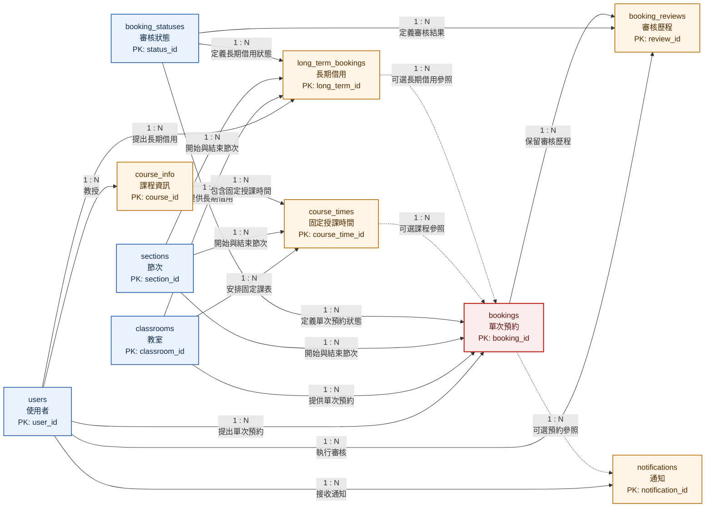

# 教室租用系統：實體關聯圖

本文件依據 [`完整資料庫Schema.sql`](../../資料庫/完整資料庫Schema.sql) 繪製 Mermaid 實體關聯圖。為提升報告與簡報之可讀性，線段中央明確標示 `1 : N`。允許空值之外鍵參照使用虛線表示。

完整欄位、資料型別與限制條件位於 [資料表詳細規格](../資料表規格/README.md)，含欄位之詳細圖面位於 [詳細實體關聯圖](ER_Diagram_Detailed.md)。

## 實體關聯圖

## 線段說明

| 線段樣式 | 標示 | 意義 |
|---|---|---|
| 實線 | `1 : N` | 一筆父實體資料得對應多筆子實體資料；子實體之外鍵為必填欄位。 |
| 虛線 | `1 : N` 與「可選參照」 | 一筆父實體資料得對應多筆子實體資料；子實體之外鍵允許為空值。 |

## 關聯類型說明

| 關聯類型 | 本系統是否存在 | 說明 |
|---|---|---|
| `1 : N` | 是 | 本系統現有關聯皆屬一對多關聯。 |
| `1 : 1` | 否 | Schema 未定義任一一對一關聯。 |
| `N : N` | 否 | Schema 未直接定義多對多關聯；多對多需求須以中介實體轉換為兩組一對多關聯。 |

## 可選參照說明

| 子實體欄位 | 父實體 | 說明 |
|---|---|---|
| `bookings.course_time_id` | `course_times` | 非課程相關借用無須參照固定授課時間。 |
| `bookings.long_term_id` | `long_term_bookings` | 一般單次預約無須參照長期借用。 |
| `notifications.booking_id` | `bookings` | 一般系統通知無須參照單次預約。 |
