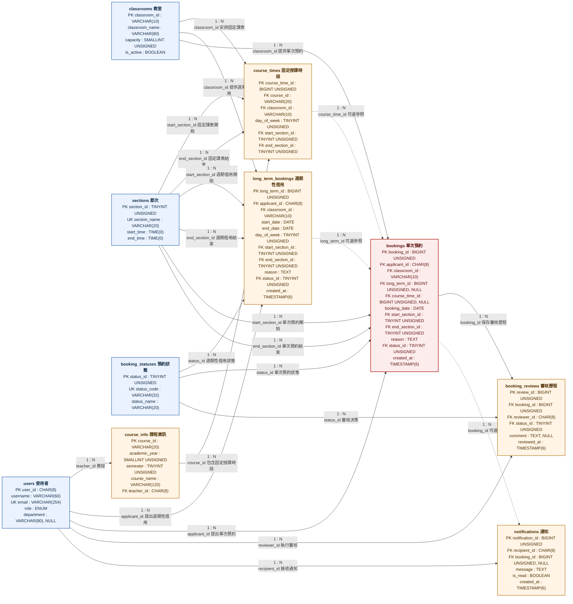

# 教室租用系統：詳細實體關聯圖

> [返回專案總覽](../../專案總覽.md) | [簡要 ER 圖](ER_Diagram.md) | [diagrams.net 原始檔](ER_Diagram_Detailed.drawio)

本圖依據 [`完整資料庫Schema.sql`](../../資料庫/完整資料庫Schema.sql) 繪製。實體方塊列出完整欄位與鍵值類型；每條線均直接標示 `1 : N`，虛線表示子實體外鍵允許 `NULL`。

## 圖例

| 標示 | 意義 |
|---|---|
| `PK` | Primary Key，唯一識別資料列且不得為空。 |
| `FK` | Foreign Key，參照另一資料表的主鍵。 |
| `UK` | Unique Key，限制欄位值不得重複。 |
| `NULL` | 欄位允許空值，表示該關聯屬於選擇性參照。 |
| 實線 `1 : N` | 子實體外鍵必填。 |
| 虛線 `1 : N` | 子實體外鍵可為 `NULL`。 |

## 關聯基數

完整 Schema 共有 22 條外鍵關聯，全部屬於 `1:N`。系統未建立 `1:1` 關聯；需要表達多對多關係時，應先建立具有雙方外鍵的中介實體，再轉換為兩組 `1:N` 關聯。

## 可選參照

| 子實體欄位 | 父實體 | 使用情境 |
|---|---|---|
| `bookings.course_time_id` | `course_times` | 課程相關借用可連結固定授課時段；一般活動借用不需要此參照。 |
| `bookings.long_term_id` | `long_term_bookings` | 週期性借用展開的單次資料可連結主紀錄；臨時預約不需要此參照。 |
| `notifications.booking_id` | `bookings` | 預約處理通知連結案件；一般系統公告不需要此參照。 |
