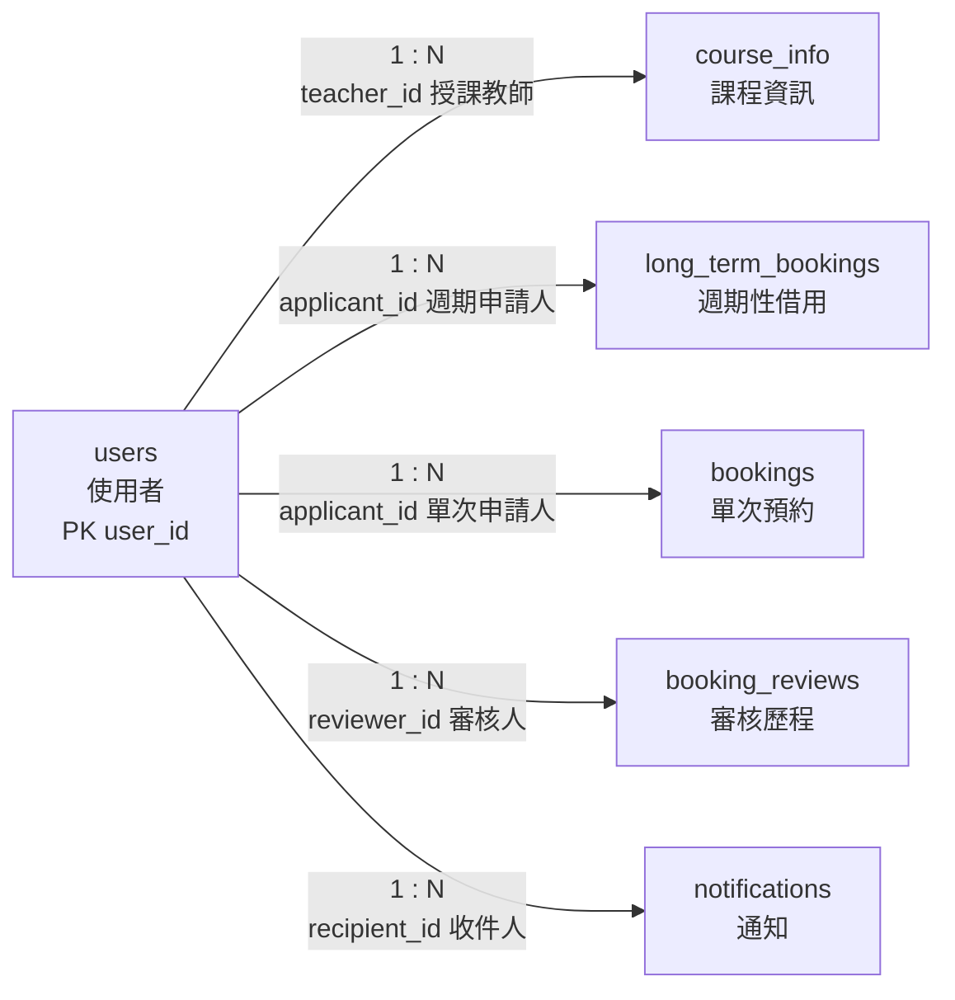

# 01. `users` 使用者

> [返回規格索引](資料表規格索引.md) | [返回專案總覽](../../專案總覽.md)

## 資料表用途

`users` 是全系統的身分主資料。課程授課教師、借用申請人、審核人員與通知收件人均透過外鍵參照本表，避免在交易資料中重複保存姓名、角色與電子郵件。

## 欄位規格與設計理由

| 欄位 | 型態 | 鍵值／預設 | 限制 | 系統用途 | 型態與限制理由 |
|---|---|---|---|---|---|
| `user_id` | `CHAR(8)` | PK | `NOT NULL`、帳號格式 `CHECK` | 使用者與 MariaDB 登入帳號的共同識別碼 | 校內學號及系統人員帳號均固定八碼，因此使用固定長度型態；主鍵確保每位使用者唯一。 |
| `username` | `VARCHAR(60)` | 無 | `NOT NULL` | 顯示申請人、教師及審核人姓名 | 姓名長度不固定，使用有上限的可變長度文字；業務流程必須能辨識使用者，因此不可為空。 |
| `email` | `VARCHAR(254)` | UK | `NOT NULL`、`UNIQUE` | 通知地址及帳號聯絡資料 | 電子郵件長度可變；唯一限制防止多個帳號共用同一地址而造成通知歸屬不明。 |
| `role` | `ENUM('student','teacher','admin')` | 無 | `NOT NULL` | 決定申請、查詢與管理權限 | 角色集合固定為三種，`ENUM` 可在資料庫層拒絕其他值。 |
| `department` | `VARCHAR(80)` | `NULL` | 可為空 | 所屬系所或行政單位 | 單位名稱長度不固定；外部或尚未分派單位的帳號可暫不填寫。 |

### 帳號格式限制

```sql
CHECK (user_id REGEXP '^([0-9]{8}|T[0-9]{7}|A[0-9]{7})$')
```

- 學生：八位數字。
- 教師：`T` 加七位數字。
- 管理員：`A` 加七位數字。

## 關聯

| 子資料表 | 外鍵 | 基數 | 意義 |
|---|---|---|---|
| `course_info` | `teacher_id` | `1:N` | 一位教師可教授多門課程。 |
| `long_term_bookings` | `applicant_id` | `1:N` | 一位教師可提出多筆週期性借用。 |
| `bookings` | `applicant_id` | `1:N` | 一位使用者可提出多筆單次預約。 |
| `booking_reviews` | `reviewer_id` | `1:N` | 一位管理員可建立多筆審核歷程。 |
| `notifications` | `recipient_id` | `1:N` | 一位使用者可收到多則通知。 |

## 局部實體關聯圖



所有連線均為必填外鍵關聯；角色是否符合教師或管理員身分，另由 Trigger 驗證。

## 其他邏輯規則

1. `course_info.teacher_id` 必須參照 `role = 'teacher'` 的使用者。
2. `booking_reviews.reviewer_id` 必須參照 `role = 'admin'` 的使用者。
3. 一般 MariaDB 帳號名稱必須與 `user_id` 相同，個人 View 才能正確過濾資料。
4. 刪除已被交易資料參照的使用者會被外鍵拒絕，以保留歷史紀錄。

## 對應 View

```sql
SELECT * FROM vw_users;
SHOW CREATE VIEW vw_users;
```

學生與教師只會看見自己的資料；管理員可看見全部使用者。

## 10 筆範例資料

| `user_id` | 姓名 | 角色 | 單位 |
|---|---|---|---|
| 41243149 | 廖章竹 | student | 資訊工程系 |
| 41243151 | 劉向榮 | student | 資訊工程系 |
| 41243154 | 蔡品辰 | student | 資訊工程系 |
| 41243161 | 羅冠穎 | student | 資訊工程系 |
| T0000001 | 王志明 | teacher | 資訊工程系 |
| T0000002 | 陳怡君 | teacher | 資訊管理系 |
| T0000003 | 林建宏 | teacher | 電機工程系 |
| T0000004 | 張雅雯 | teacher | 通識教育中心 |
| A0000001 | 教務處管理員 | admin | 教務處課務組 |
| A0000002 | 資產組管理員 | admin | 總務處資產組 |
