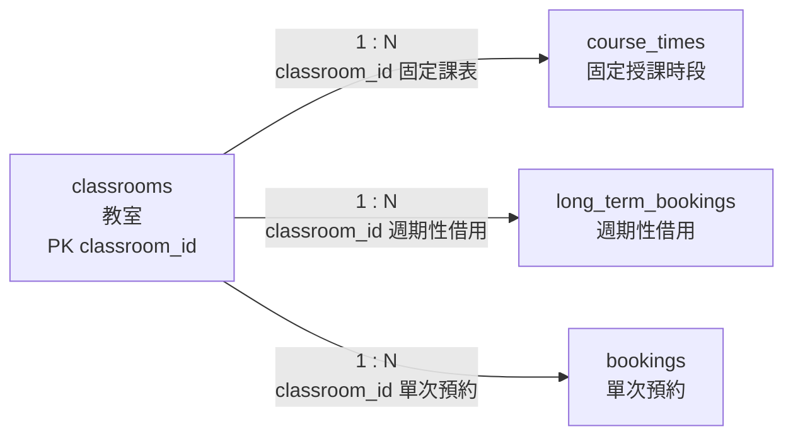

# 02. `classrooms` 教室

> [返回規格索引](資料表規格索引.md) | [返回專案總覽](../../專案總覽.md)

## 資料表用途

`classrooms` 保存可排課或借用的空間主資料。固定課表、週期性借用與單次預約均以 `classroom_id` 參照本表。

## 欄位規格與設計理由

| 欄位 | 型態 | 鍵值／預設 | 限制 | 系統用途 | 型態與限制理由 |
|---|---|---|---|---|---|
| `classroom_id` | `VARCHAR(10)` | PK | `NOT NULL` | 教室、實驗室或會議室代碼 | `A101`、`LAB501`、`CONF01` 長度不同，因此使用可變長度代碼；主鍵防止重複登錄。 |
| `classroom_name` | `VARCHAR(80)` | 無 | `NOT NULL` | 顯示正式空間名稱 | 名稱長度不固定，且所有教室都必須有可辨識名稱。 |
| `capacity` | `SMALLINT UNSIGNED` | 無 | `NOT NULL`、`CHECK (capacity > 0)` | 表示合法容納人數 | 人數不得為負值，`SMALLINT` 已足以涵蓋一般校園空間；零容量不具可借用意義。 |
| `is_active` | `BOOLEAN` | `TRUE` | `NOT NULL`、布林檢查 | 控制是否開放新預約 | 只有啟用與停用兩種狀態；預設新教室為啟用，停用教室由 Trigger 阻擋新預約。 |

## 關聯

| 子資料表 | 外鍵 | 基數 | 意義 |
|---|---|---|---|
| `course_times` | `classroom_id` | `1:N` | 一間教室可安排多筆不同星期或節次的固定課表。 |
| `long_term_bookings` | `classroom_id` | `1:N` | 一間教室可具有多筆週期性借用規則。 |
| `bookings` | `classroom_id` | `1:N` | 一間教室可累積多筆不同日期的預約。 |

## 局部實體關聯圖



三條連線均為必填外鍵；教室停用時保留既有關聯資料，但不得接受新的待審核或已核准預約。

## 其他邏輯規則

1. `capacity` 必須大於零。
2. `is_active = FALSE` 時不得建立新的待審核或已核准預約。
3. 停用教室仍保留既有課表與歷史預約，避免刪除稽核資料。
4. 同一教室的已核准預約及固定課表不得發生節次重疊。

## 對應 View

```sql
SELECT * FROM vw_classrooms ORDER BY classroom_id;
```

一般使用者只會看見啟用教室；管理員可查看全部資料。

## 10 筆範例資料

| 代碼 | 名稱 | 容量 |
|---|---|---:|
| A101 | A101 一般教室 | 50 |
| A102 | A102 多媒體教室 | 45 |
| B201 | B201 階梯教室 | 80 |
| B202 | B202 討論教室 | 36 |
| B205 | B205 電腦教室 | 40 |
| C301 | C301 智慧教室 | 48 |
| C302 | C302 語言教室 | 32 |
| D401 | D401 專題教室 | 30 |
| LAB501 | LAB501 物聯網實驗室 | 24 |
| CONF01 | 第一會議室 | 20 |
