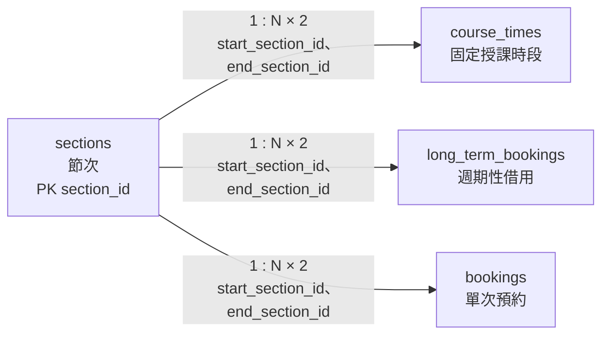

# 03. `sections` 節次

> [返回規格索引](資料表規格索引.md) | [返回專案總覽](../../專案總覽.md)

## 資料表用途

`sections` 集中定義全校共用的節次名稱與每日起訖時刻。課程與預約只保存節次外鍵，不重複保存時間文字，避免不同資料表出現不一致的作息定義。

## 欄位規格與設計理由

| 欄位 | 型態 | 鍵值／預設 | 限制 | 系統用途 | 型態與限制理由 |
|---|---|---|---|---|---|
| `section_id` | `TINYINT UNSIGNED` | PK | `NOT NULL` | 節次排序及外鍵識別 | 節次數量小且不得為負數，`TINYINT UNSIGNED` 已足夠；主鍵同時提供自然排序。 |
| `section_name` | `VARCHAR(20)` | UK | `NOT NULL`、`UNIQUE` | 顯示「第 1 節」等正式名稱 | 名稱長度可因學校制度改變，使用可變長度文字；唯一限制避免同名節次重複。 |
| `start_time` | `TIME(0)` | 無 | `NOT NULL`、單日時刻檢查 | 每日節次開始時刻 | 只需時、分、秒，不需要日期、小數秒或時區，因此使用 `TIME(0)`。 |
| `end_time` | `TIME(0)` | 無 | `NOT NULL`、單日時刻檢查、晚於開始時刻 | 每日節次結束時刻 | 與開始時刻使用相同 Domain，並以 `CHECK` 防止零長度或反向時段。 |

## 時間型態說明

- `TIME(0)` 的 `(0)` 表示不保存小數秒。
- MariaDB `TIME` 可表示超過 24 小時的期間，因此另以 `CHECK` 限制於 `00:00:00` 至 `23:59:59`。
- 節次表示每日鐘面時刻，不會執行時區轉換。

## 關聯

`course_times`、`long_term_bookings`、`bookings` 均以 `start_section_id` 與 `end_section_id` 參照本表。每一個節次可被多筆課表或預約使用，因此關聯為 `1:N`。

## 局部實體關聯圖



每個子實體都以兩個必填外鍵參照 `sections`，分別表示開始節次與結束節次。

## 其他邏輯規則

1. `start_time` 必須早於 `end_time`。
2. 節次名稱不得重複。
3. 參照節次的資料表必須限制 `start_section_id <= end_section_id`。
4. 節次時間調整會影響所有既有課表與預約的顯示時間，因此應由管理員集中維護。

## 對應 View

```sql
SELECT * FROM vw_sections ORDER BY section_id;
```

## 10 筆範例資料

| 編號 | 名稱 | 開始 | 結束 |
|---:|---|---|---|
| 1 | 第 1 節 | 08:10:00 | 09:00:00 |
| 2 | 第 2 節 | 09:10:00 | 10:00:00 |
| 3 | 第 3 節 | 10:10:00 | 11:00:00 |
| 4 | 第 4 節 | 11:10:00 | 12:00:00 |
| 5 | 第 5 節 | 13:20:00 | 14:10:00 |
| 6 | 第 6 節 | 14:20:00 | 15:10:00 |
| 7 | 第 7 節 | 15:20:00 | 16:10:00 |
| 8 | 第 8 節 | 16:20:00 | 17:10:00 |
| 9 | 第 9 節 | 17:20:00 | 18:10:00 |
| 10 | 第 10 節 | 18:20:00 | 19:10:00 |
