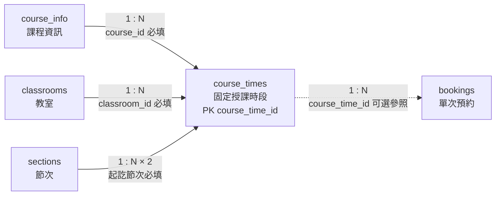

# 06. `course_times` 固定授課時段

> [返回規格索引](資料表規格索引.md) | [返回專案總覽](../../專案總覽.md)

## 資料表用途

`course_times` 將課程配置至固定的星期、教室與節次範圍，是固定課表與臨時預約衝突檢查的依據。

## 欄位規格與設計理由

| 欄位 | 型態 | 鍵值／預設 | 限制 | 系統用途 | 型態與限制理由 |
|---|---|---|---|---|---|
| `course_time_id` | `BIGINT UNSIGNED` | PK、`AUTO_INCREMENT` | `NOT NULL` | 固定課表紀錄識別碼 | 一門課程可有多筆時段，無適合的單一自然鍵，因此使用自動遞增代理鍵。 |
| `course_id` | `VARCHAR(20)` | FK | `NOT NULL` | 指定所屬課程 | 型態與 `course_info.course_id` 完全一致，外鍵確保課程存在。 |
| `classroom_id` | `VARCHAR(10)` | FK | `NOT NULL` | 指定授課教室 | 型態與 `classrooms.classroom_id` 一致，避免不存在的教室進入課表。 |
| `day_of_week` | `TINYINT UNSIGNED` | 無 | `NOT NULL`、`CHECK 1..7` | 表示星期一至星期日 | 值域固定且不得為負值，`1` 對應星期一、`7` 對應星期日。 |
| `start_section_id` | `TINYINT UNSIGNED` | FK | `NOT NULL` | 固定課程開始節次 | 參照 `sections`，避免重複保存時間。 |
| `end_section_id` | `TINYINT UNSIGNED` | FK | `NOT NULL`、不得早於開始節次 | 固定課程結束節次 | 與開始節次使用相同 Domain，`CHECK` 防止反向範圍。 |

## 關聯

| 父實體 | 基數 | 用途 |
|---|---|---|
| `course_info` | `1:N` | 一門課程可具有多個固定時段。 |
| `classrooms` | `1:N` | 一間教室可在不同星期與節次安排多門課。 |
| `sections` | `1:N` | 節次可作為多筆課表的開始或結束。 |

`bookings.course_time_id` 可選擇性參照本表，用於標示與特定課程時段相關的額外借用。

## 局部實體關聯圖



前三條實線為 `course_times` 的必填外鍵；通往 `bookings` 的虛線表示一般預約可不隸屬固定課程時段。

## 其他邏輯規則

1. 同一教室、同一星期的固定課表不得發生節次重疊。
2. 新增或修改固定課表時，不得與相同教室、相同星期的已核准預約重疊。
3. 星期值固定使用 `1` 至 `7`，並與 `WEEKDAY(date) + 1` 的結果一致。
4. 開始節次不得晚於結束節次。

## 對應 View

```sql
SELECT * FROM vw_course_times ORDER BY course_time_id;
```

## 10 筆範例資料

| ID | 課程 | 教室 | 星期 | 節次 |
|---:|---|---|---:|---|
| 1 | 11422012 | BGC0513 | 3 | 1–3 |
| 2 | 11422016 | BGC0614 | 5 | 5–7 |
| 3 | 11422009 | BGC0601 | 3 | 5–7 |
| 4 | 11422011 | BGC0513 | 4 | 8–9 |
| 5 | 11422011 | BGC0513 | 5 | 1–1 |
| 6 | 11422013 | BRA0201 | 4 | 5–7 |
| 7 | 11422014 | BGC0501 | 2 | 7–7 |
| 8 | 11422014 | BGC0501 | 4 | 1–2 |
| 9 | 11422015 | BGC0501 | 2 | 1–3 |
| 10 | 11422018 | BGC0513 | 5 | 2–4 |
