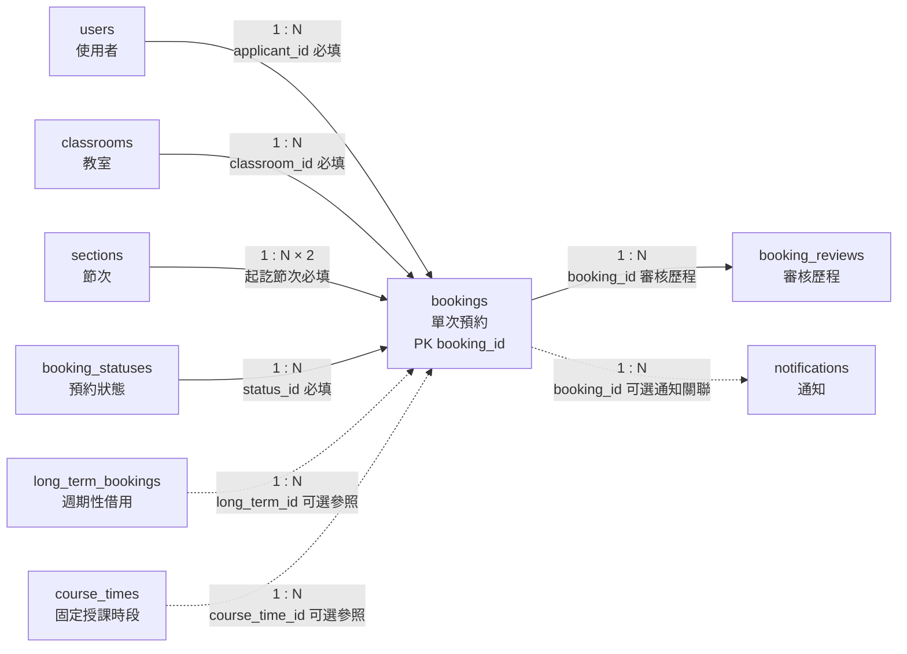

# 08. `bookings` 單次預約

> [返回規格索引](資料表規格索引.md) | [返回專案總覽](../../專案總覽.md)

## 資料表用途

`bookings` 是系統的核心交易資料表。每筆資料表示特定日期、教室與節次範圍的一次借用申請或使用紀錄，無論來源是一般臨時申請、週期性借用展開或課程相關使用。

## 欄位規格與設計理由

| 欄位 | 型態 | 鍵值／預設 | 限制 | 系統用途 | 型態與限制理由 |
|---|---|---|---|---|---|
| `booking_id` | `BIGINT UNSIGNED` | PK、`AUTO_INCREMENT` | `NOT NULL` | 預約識別碼 | 預約會長期大量累積，使用大型無號代理鍵。 |
| `applicant_id` | `CHAR(8)` | FK | `NOT NULL` | 提出申請的學生或教師 | 與使用者主鍵型態一致；Trigger 防止冒用其他使用者。 |
| `classroom_id` | `VARCHAR(10)` | FK | `NOT NULL` | 借用教室 | 外鍵確保教室存在，Trigger 驗證教室是否啟用。 |
| `long_term_id` | `BIGINT UNSIGNED` | FK、`NULL` | 可為空 | 關聯週期性借用主紀錄 | 一般臨時申請沒有週期性來源，因此允許 `NULL`。 |
| `course_time_id` | `BIGINT UNSIGNED` | FK、`NULL` | 可為空 | 關聯特定固定課程時段 | 非課程用途沒有課程時段來源，因此允許 `NULL`。 |
| `booking_date` | `DATE` | 無 | `NOT NULL` | 實際借用日曆日期 | 日期不包含時刻，節次另由外鍵表示；不因時區轉換改變。 |
| `start_section_id` | `TINYINT UNSIGNED` | FK | `NOT NULL` | 借用開始節次 | 參照統一節次主資料。 |
| `end_section_id` | `TINYINT UNSIGNED` | FK | `NOT NULL`、不得早於開始節次 | 借用結束節次 | 以 `CHECK` 阻止反向節次。 |
| `reason` | `TEXT` | 無 | `NOT NULL` | 借用用途與行政審核依據 | 說明長度不固定，且申請不可缺少用途。 |
| `status_id` | `TINYINT UNSIGNED` | FK | `NOT NULL` | 現行處理狀態 | 狀態由主資料統一管理，避免直接保存不一致文字。 |
| `created_at` | `TIMESTAMP(6)` | `CURRENT_TIMESTAMP(6)` | `NOT NULL` | 申請建立事件時間 | 支援時區轉換、微秒排序及稽核。 |

## 關聯

| 關聯實體 | 基數 | 必填 |
|---|---|---|
| `users` | `1:N` | 是 |
| `classrooms` | `1:N` | 是 |
| `sections` | `1:N` | 是 |
| `booking_statuses` | `1:N` | 是 |
| `long_term_bookings` | `1:N` | 否 |
| `course_times` | `1:N` | 否 |
| `booking_reviews` | `1:N` | 子資料 |
| `notifications` | `1:N` | 子資料 |

## 局部實體關聯圖



指向 `bookings` 的實線為必填外鍵，虛線為可選來源；由 `bookings` 指向子實體的連線表示一筆預約可保留多次審核及多則通知。

## 其他邏輯規則

1. 學生與教師只能建立自己的 `pending` 預約。
2. 一般使用者只能修改或取消自己的待審核預約。
3. 停用教室不得接受新的待審核或已核准預約。
4. 只有 `approved` 會占用教室。
5. 已核准預約不得與相同教室、相同星期與重疊節次的固定課表衝突。
6. 已核准預約不得與相同教室、相同日期與重疊節次的其他已核准預約衝突。
7. 多筆尚未核准的申請可以並存，管理員核准時重新執行衝突檢查。

## 對應 View

```sql
SELECT * FROM vw_bookings ORDER BY created_at DESC;
```

一般使用者只會看見自己的預約；管理員可看見全部。

## 10 筆範例資料

| ID | 申請人 | 教室 | 日期／節次 | 狀態 |
|---:|---|---|---|---|
| 1 | 41243149 | BGC0508 | 2026-06-08／5–6 | approved |
| 2 | 41243154 | BGC0614 | 2026-06-08／1–2 | approved |
| 3 | B13001 | BRA0102 | 2026-06-08／8–9 | approved |
| 4 | 41243151 | BCB0303 | 2026-06-09／5–5 | approved |
| 5 | 41243149 | BGC0508 | 2026-06-12／5–6 | approved |
| 6 | 41243161 | BGC0614 | 2026-06-10／5–6 | pending |
| 7 | B13005 | BCB0305 | 2026-06-10／7–8 | rejected |
| 8 | 41243154 | BGC0513 | 2026-06-11／5–6 | canceled |
| 9 | B13023 | BGC0601 | 2026-06-12／1–2 | approved |
| 10 | 41243151 | BRA0201 | 2026-06-12／8–9 | pending |
