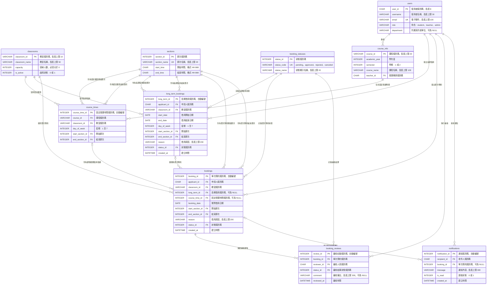

# 教室租用系統：實體關聯圖

本文件依據 `Part2_schema.sql` 繪製 Mermaid 實體關聯圖。圖中包含 10 個實體、主要欄位、鍵值類型與關聯基數。

## 實體關聯圖

## 關聯基數說明

| Mermaid 符號 | 意義 |
|---|---|
| `||` | 必須且僅能對應一筆資料 |
| `o|` | 得對應零筆或一筆資料 |
| `o{` | 得對應零筆或多筆資料 |

## 設計說明

| 項目 | 說明 |
|---|---|
| 主鍵 | 每個實體皆具有主鍵，以維持實體完整性。 |
| 外鍵 | 關聯欄位以外鍵連結父實體，以維持參照完整性。 |
| 唯一鍵 | `users.email`、`sections.section_name` 與 `booking_statuses.status_code` 使用唯一鍵，避免重複資料。 |
| 可選關聯 | `bookings.long_term_id`、`bookings.course_time_id` 與 `notifications.booking_id` 允許為空值，因此其父實體關聯以 `o|` 表示。 |
| 衝突驗證 | Mermaid 圖呈現資料結構；固定課表與預約時段之衝突驗證由 `Part2_schema.sql` 內的觸發器執行。 |
