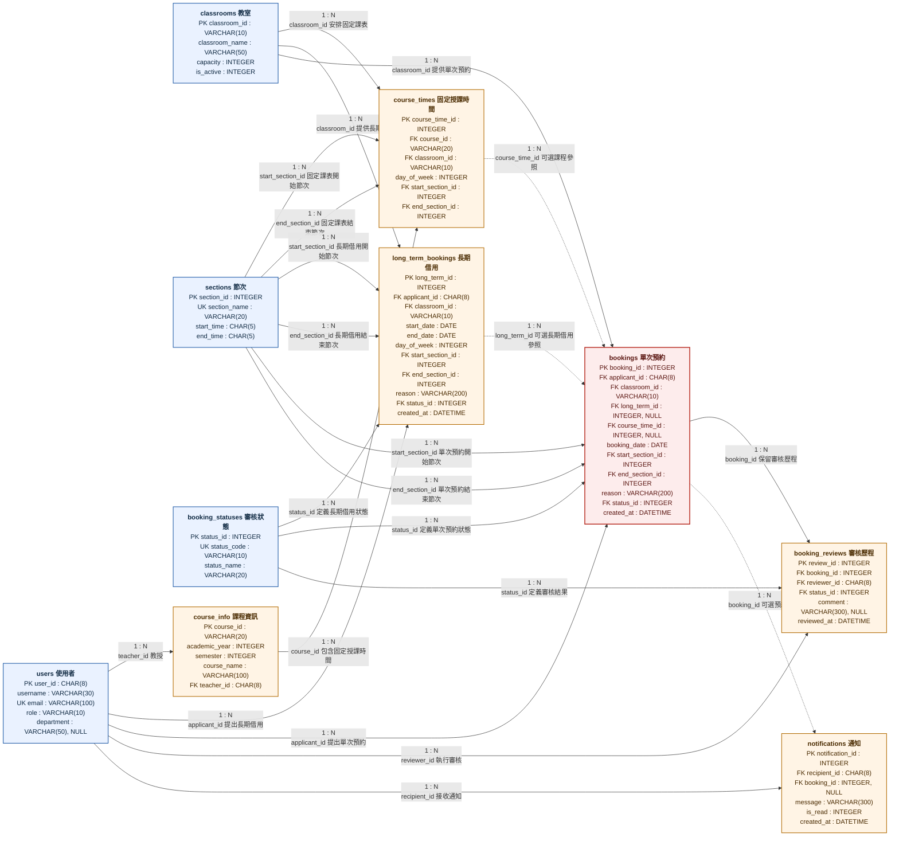

# 教室租用系統：詳細實體關聯圖

本文件依據 `Part2_schema.sql` 繪製詳細版 Mermaid 實體關聯圖。各實體方塊列出完整欄位、資料型別與鍵值類型；線段中央標示 `1 : N`。允許空值之外鍵參照使用虛線表示。

適合簡報使用之精簡版本位於 [`ER_Diagram.md`](./ER_Diagram.md)。

## 詳細實體關聯圖

## 鍵值標記

| 標記 | 名稱 | 說明 |
|---|---|---|
| `PK` | Primary Key | 主鍵，用於唯一識別每筆資料。 |
| `FK` | Foreign Key | 外鍵，用於參照其他實體。 |
| `UK` | Unique Key | 唯一鍵，用於限制欄位值不得重複。 |
| `NULL` | Nullable | 欄位允許為空值。 |

## 線段說明

| 線段樣式 | 標示 | 意義 |
|---|---|---|
| 實線 | `1 : N` | 一筆父實體資料得對應多筆子實體資料；子實體之外鍵為必填欄位。 |
| 虛線 | `1 : N` 與「可選參照」 | 一筆父實體資料得對應多筆子實體資料；子實體之外鍵允許為空值。 |

## 可選參照說明

| 子實體欄位 | 父實體 | 說明 |
|---|---|---|
| `bookings.course_time_id` | `course_times` | 非課程相關借用無須參照固定授課時間。 |
| `bookings.long_term_id` | `long_term_bookings` | 一般單次預約無須參照長期借用。 |
| `notifications.booking_id` | `bookings` | 一般系統通知無須參照單次預約。 |

## 關聯類型說明

本系統現有關聯皆屬 `1 : N`。目前未設置 `1 : 1` 或 `N : N` 關聯。
