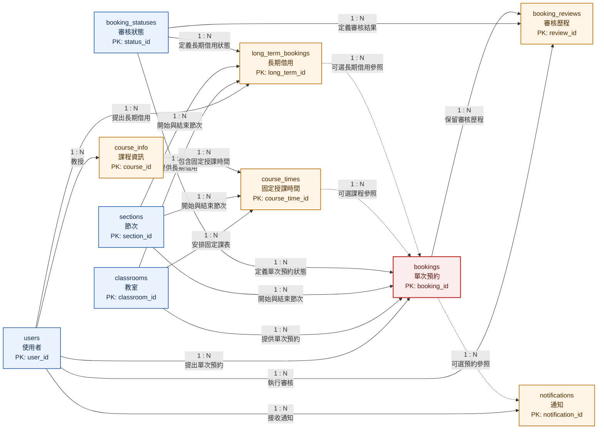

# 教室租用系統資料庫設計

本目錄為教室租用系統之完整資料庫設計報告。內容依一般 GitHub 專案文件慣例，整合系統需求、實體關聯圖、Schema 架構、完整性限制、SQL 範例、測試結果與可編輯附件，不再依作業階段分割。

完整文件入口位於 [`專案總覽.md`](./專案總覽.md)，可逐層點選各項設計文件與 10 份實體說明。

## 目錄

- [實體關聯圖](#實體關聯圖)
- [系統目標](#系統目標)
- [應用情境](#應用情境)
- [功能需求](#功能需求)
- [資料庫設計摘要](#資料庫設計摘要)
- [完整性限制](#完整性限制)
- [執行方式](#執行方式)
- [驗證摘要](#驗證摘要)
- [文件導覽](#文件導覽)

## 實體關聯圖

下圖為適合 GitHub 首頁閱讀之精簡版實體關聯圖。所有現有關聯皆屬 `1 : N`。虛線表示子實體之外鍵允許為空值。



詳細欄位圖表與可編輯檔案：

- [`ER_Diagram_Detailed.md`](./ER_Diagram_Detailed.md)：完整欄位與鍵值標記之 Mermaid 圖。
- [`ER_Diagram_Detailed.drawio`](./ER_Diagram_Detailed.drawio)：使用 [diagrams.net](https://app.diagrams.net/) 製作之可編輯圖檔。
- [`實體資料表格`](./實體資料表格/README.md)：逐一說明 10 個實體之欄位、關聯與邏輯規則。

## 系統目標

本系統用於管理學校教室之固定排課與臨時借用，並確保相同教室不會在重疊時段內同時分配給多筆已核准使用紀錄。

核心處理流程如下：

1. 建立教室、節次、使用者與狀態基本資料。
2. 匯入學期固定課程與授課時間。
3. 接收單次或長期借用申請。
4. 由管理員審核案件並保留歷程。
5. 於核准前執行教室時段衝突驗證。
6. 將審核結果傳送給申請人。

## 應用情境

- 學期開始前匯入表定課表。
- 教師臨時調課時異動教室安排。
- 學生借用教室進行專題會議。
- 班級借用教室召開班會或舉辦活動。
- 課程考試期間另外申請考場。
- 管理員查詢歷史紀錄與教室使用狀況。

## 功能需求

| 功能 | 說明 |
|---|---|
| 教室預約申請 | 使用者指定教室、日期、開始節次、結束節次與借用原因。 |
| 教室狀態查詢 | 系統依日期與節次查詢教室使用狀況。 |
| 管理員審核 | 管理員核准、拒絕或取消借用案件。 |
| 狀態通知 | 系統保存通知內容與讀取狀態。 |
| 固定課表管理 | 系統保存課程、授課教師、教室、星期與節次範圍。 |
| 長期借用 | 系統保存週期性借用父單據，並由程式流程展開為單次預約。 |
| 歷史紀錄 | 系統保留申請、審核與通知紀錄。 |

## 資料庫設計摘要

本系統使用 MariaDB，資料表採用 `InnoDB` 儲存引擎與 `utf8mb4` 字元集。Schema 共包含 10 個資料表：

| 資料表 | 用途 |
|---|---|
| `users` | 保存學生、教師與管理員資料 |
| `classrooms` | 保存教室基本資料與啟用狀態 |
| `sections` | 保存學校節次與起訖時間 |
| `booking_statuses` | 保存待審核、已核准、已拒絕與已取消狀態 |
| `course_info` | 保存學期課程與授課教師 |
| `course_times` | 保存固定課表安排 |
| `long_term_bookings` | 保存長期借用父單據 |
| `bookings` | 保存每一次實際教室借用 |
| `booking_reviews` | 保存管理員審核歷程 |
| `notifications` | 保存通知內容與讀取狀態 |

完整 SQL Schema 與設計依據：

- [`schema.sql`](./schema.sql)：可執行之 MariaDB 建表語法。
- [`Schema_設計說明.md`](./Schema_設計說明.md)：設計方法、架構依據、限制條件、觸發器、索引與 SQL 範例。

## 完整性限制

| 類型 | 實作方式 | 說明 |
|---|---|---|
| 實體完整性 | `PRIMARY KEY` | 每筆資料具有唯一識別碼。 |
| 參照完整性 | `FOREIGN KEY` | 外鍵必須參照至已存在之父資料。 |
| 域完整性 | `NOT NULL`、`UNIQUE`、`CHECK`、`DEFAULT` | 限制角色、狀態、日期、節次、容量與布林值。 |
| 商業規則完整性 | Trigger | 防止固定課表與已核准預約發生時段衝突。 |

## 執行方式

進入本目錄後，依序執行：

```powershell
mariadb -u root -p -e "CREATE DATABASE IF NOT EXISTS classroom_rental CHARACTER SET utf8mb4 COLLATE utf8mb4_unicode_ci;"
mariadb -u root -p classroom_rental < schema.sql
mariadb -u root -p classroom_rental < examples.sql
```

`schema.sql` 內的資料表均明確指定 `ENGINE=InnoDB`。MariaDB 會在資料異動時檢查外鍵參照完整性。

## 驗證摘要

| 測試情境 | 預期結果 |
|---|---|
| 建立合法使用者、教室與預約 | 接受 |
| 預約引用不存在之教室 | 拒絕 |
| 預約結束節次早於開始節次 | 拒絕 |
| 同一教室之固定課表節次重疊 | 拒絕 |
| 已核准預約與既有固定課表重疊 | 拒絕 |
| 同一教室之已核准預約重疊 | 拒絕 |
| 同一時段存在多筆待審核申請 | 接受，核准時再次驗證 |

完整測試內容位於 [`驗證說明.md`](./驗證說明.md)。

## 文件導覽

| 文件 | 用途 |
|---|---|
| [`專案總覽.md`](./專案總覽.md) | 提供完整專案介紹與可點選之文件、SQL、ER 圖及實體導覽。 |
| [`專案詳細說明.txt`](./專案詳細說明.txt) | 彙整專案目標、需求、資料庫方法、完整性限制、各實體、關聯、觸發器、索引、驗證與擴充項目。 |
| [`Schema_設計說明.md`](./Schema_設計說明.md) | 獨立說明 SQL Schema 架構、方法、依據與實際範例。 |
| [`schema.sql`](./schema.sql) | 建立資料表、外鍵、檢查限制、索引與觸發器。 |
| [`examples.sql`](./examples.sql) | 建立示範資料、執行查詢並提供可取消註解之衝突測試。 |
| [`驗證說明.md`](./驗證說明.md) | 說明已執行之正確資料與錯誤資料測試。 |
| [`ER_Diagram.md`](./ER_Diagram.md) | 適合 GitHub 首頁與簡報使用之精簡 Mermaid 關聯圖。 |
| [`ER_Diagram_Detailed.md`](./ER_Diagram_Detailed.md) | 列出完整欄位、鍵值與關聯基數之詳細 Mermaid 關聯圖。 |
| [`ER_Diagram_Detailed.drawio`](./ER_Diagram_Detailed.drawio) | 可於 diagrams.net 開啟與編輯之詳細 ER 圖。 |
| [`實體資料表格`](./實體資料表格/README.md) | 10 個實體之獨立說明文件索引。 |
| [`教室租用系統資料庫設計簡報.pptx`](./教室租用系統資料庫設計簡報.pptx) | 保留原始版本之課堂簡報；本次 MariaDB 遷移不修改此檔案。 |
