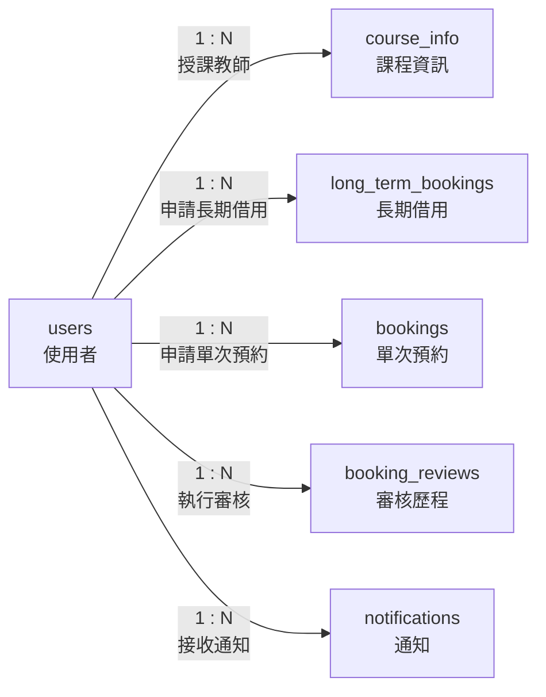

# 01. users：使用者

> [返回專案總覽](../專案總覽.md) | [返回實體索引](./README.md)

## 用途

保存學生、教師與管理員的基本資料。課程授課教師、預約申請人、審核人員與通知收件人皆會參照此實體。

## 欄位表格

| 編號 | 欄位名稱 | 資料型別 | 必填 | 鍵值或參照 | 預設值 | 完整性限制 | 說明 |
|---|---|---|---|---|---|---|---|
| 1 | `user_id` | `CHAR(8)` | 是 | PK | 無 | 主鍵不可重複、不可為空值 | 使用者識別碼 |
| 2 | `username` | `VARCHAR(30)` | 是 | - | 無 | `NOT NULL` | 使用者名稱 |
| 3 | `email` | `VARCHAR(100)` | 是 | UK | 無 | `NOT NULL`、`UNIQUE` | 電子郵件，同一信箱不可重複註冊 |
| 4 | `role` | `VARCHAR(10)` | 是 | - | 無 | `NOT NULL`、`CHECK (role IN ('student', 'teacher', 'admin'))` | 身分角色 |
| 5 | `department` | `VARCHAR(50)` | 否 | - | `NULL` | 可為空值 | 所屬系所或單位 |

## 局部實體關聯圖

## 關聯實體

| 關聯實體 | 關聯類型 | 對方外鍵 | 說明 | 使用範例 |
|---|---|---|---|---|
| `course_info` | `users` 1:N `course_info` | `course_info.teacher_id` → `users.user_id` | 一位教師得教授多門課程 | 教師 `T0000001` 可對應資料庫系統與程式設計兩門課程。 |
| `long_term_bookings` | `users` 1:N `long_term_bookings` | `long_term_bookings.applicant_id` → `users.user_id` | 一位使用者得提出多筆長期借用 | 學生 `41243149` 可提出每週二與每週四的長期借用。 |
| `bookings` | `users` 1:N `bookings` | `bookings.applicant_id` → `users.user_id` | 一位使用者得提出多筆單次預約 | 學生 `41243149` 可申請 `2026-06-08` 與 `2026-06-15` 的借用。 |
| `booking_reviews` | `users` 1:N `booking_reviews` | `booking_reviews.reviewer_id` → `users.user_id` | 一位管理員得執行多次審核 | 管理員 `A0000001` 可依序審核多筆預約。 |
| `notifications` | `users` 1:N `notifications` | `notifications.recipient_id` → `users.user_id` | 一位使用者得接收多則通知 | 學生 `41243149` 可收到核准通知與取消通知。 |

## 其他邏輯規則

| 規則 | 說明 |
|---|---|
| 電子郵件唯一 | `email` 使用 `UNIQUE`，避免不同帳號使用相同信箱。 |
| 角色限制 | `role` 只能是 `student`、`teacher` 或 `admin`。 |
| 教師角色 | 被 `course_info.teacher_id` 參照的使用者應為 `teacher`。 |
| 審核角色 | 被 `booking_reviews.reviewer_id` 參照的使用者應為 `admin`。 |
| 可選系所 | `department` 允許為空值，以支援未指定單位或不屬於特定系所之帳號。 |
| 應用程式驗證 | MariaDB Schema 已限制外鍵存在性；教師與管理員之角色符合性應由應用程式層執行驗證。 |
