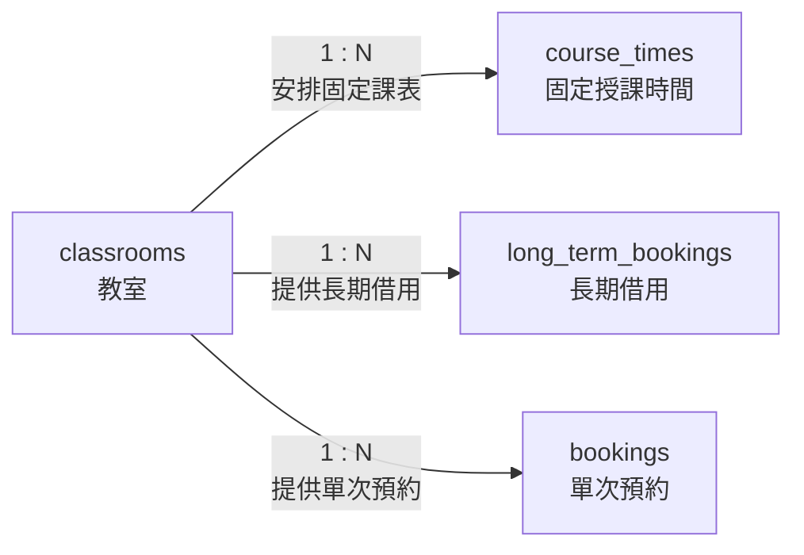

# 02. classrooms：教室

> [返回專案總覽](../專案總覽.md) | [返回實體索引](./README.md)

## 用途

保存可被排課或借用的教室資料，包括教室名稱、容納人數與是否開放使用。

## 欄位表格

| 編號 | 欄位名稱 | 資料型別 | 必填 | 鍵值或參照 | 預設值 | 完整性限制 | 說明 |
|---|---|---|---|---|---|---|---|
| 1 | `classroom_id` | `VARCHAR(10)` | 是 | PK | 無 | 主鍵不可重複、不可為空值 | 教室識別碼，例如 `B205` |
| 2 | `classroom_name` | `VARCHAR(50)` | 是 | - | 無 | `NOT NULL` | 教室顯示名稱 |
| 3 | `capacity` | `INT` | 是 | - | 無 | `NOT NULL`、`CHECK (capacity > 0)` | 可容納人數，必須大於 0 |
| 4 | `is_active` | `TINYINT(1)` | 是 | - | `1` | `NOT NULL`、`CHECK (is_active IN (0, 1))` | 是否開放使用：`1` 為啟用，`0` 為停用 |

## 局部實體關聯圖

## 關聯實體

| 關聯實體 | 關聯類型 | 對方外鍵 | 說明 | 使用範例 |
|---|---|---|---|---|
| `course_times` | `classrooms` 1:N `course_times` | `course_times.classroom_id` → `classrooms.classroom_id` | 一間教室得安排多筆固定課表 | `A101` 可安排星期二資料庫系統與星期四程式設計。 |
| `long_term_bookings` | `classrooms` 1:N `long_term_bookings` | `long_term_bookings.classroom_id` → `classrooms.classroom_id` | 一間教室得具有多筆長期借用計畫 | `B205` 可保存不同月份的週期性會議借用。 |
| `bookings` | `classrooms` 1:N `bookings` | `bookings.classroom_id` → `classrooms.classroom_id` | 一間教室得具有多筆不同日期之單次預約 | `B205` 可在 `2026-06-08` 與 `2026-06-15` 保存不同預約。 |

## 其他邏輯規則

| 規則 | 說明 |
|---|---|
| 容量限制 | `capacity` 必須大於 0。 |
| 啟用狀態 | `is_active` 只能為 `0` 或 `1`，預設值為 `1`。 |
| 停用教室 | 停用教室不得接受新預約。此條件應由應用程式層於新增申請前執行驗證。 |
| 時段衝突 | 固定課表與已核准預約之重疊驗證由 `course_times` 與 `bookings` 的觸發器執行。 |
