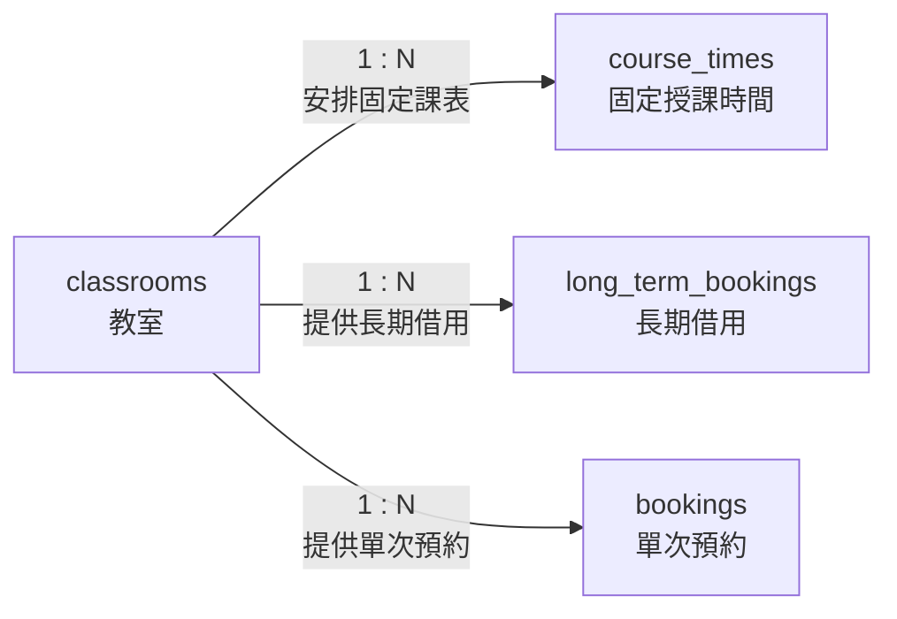

# 02. classrooms：教室

> [返回專案總覽](../專案總覽.md) | [返回實體索引](./README.md)

## 用途

保存可被排課或借用的教室資料，包括教室名稱、容納人數與是否開放使用。

## 欄位表格

| 編號 | 欄位名稱 | 資料型別 | 必填 | 鍵值或參照 | 預設值 | 完整性限制 | 說明 |
|---|---|---|---|---|---|---|---|
| 1 | `classroom_id` | `CHAR(10)` | 是 | PK | 無 | 主鍵不可重複、不可為空值 | 制度化教室代碼，例如 `B205` |
| 2 | `classroom_name` | `VARCHAR(80)` | 是 | - | 無 | `NOT NULL` | 長度可變的教室顯示名稱 |
| 3 | `capacity` | `SMALLINT UNSIGNED` | 是 | - | 無 | `NOT NULL`、`CHECK (capacity > 0)` | 非負且大於 0 的可容納人數 |
| 4 | `is_active` | `BOOLEAN` | 是 | - | `TRUE` | `NOT NULL`、布林值檢查 | 是否開放使用 |

## 局部實體關聯圖



## 關聯實體

| 關聯實體 | 關聯類型 | 對方外鍵 | 說明 | 使用範例 |
|---|---|---|---|---|
| `course_times` | `classrooms` 1:N `course_times` | `course_times.classroom_id` → `classrooms.classroom_id` | 一間教室得安排多筆固定課表 | `A101` 可安排星期二資料庫系統與星期四程式設計。 |
| `long_term_bookings` | `classrooms` 1:N `long_term_bookings` | `long_term_bookings.classroom_id` → `classrooms.classroom_id` | 一間教室得具有多筆長期借用計畫 | `B205` 可保存不同月份的週期性會議借用。 |
| `bookings` | `classrooms` 1:N `bookings` | `bookings.classroom_id` → `classrooms.classroom_id` | 一間教室得具有多筆不同日期之單次預約 | `B205` 可在 `2026-06-08` 與 `2026-06-15` 保存不同預約。 |

## 其他邏輯規則

| 規則 | 說明 |
|---|---|
| 容量限制 | `capacity` 必須大於 0。 |
| 啟用狀態 | `is_active` 只能為 `0` 或 `1`，預設值為 `1`。 |
| 停用教室 | `bookings` Trigger 會拒絕對停用教室新增或維持待審核、已核准預約。 |
| 時段衝突 | 固定課表與已核准預約之重疊驗證由 `course_times` 與 `bookings` 的觸發器執行。 |

## Domain 與對應 View

教室代碼使用 `CHAR(10)`；容量使用無號小整數；啟用狀態使用 `BOOLEAN`。只有名稱長度會依教室而改變，因此使用 `VARCHAR(80)`。

```sql
SELECT * FROM vw_classrooms;
SHOW CREATE VIEW vw_classrooms;
```

一般使用者只會取得 `is_active = TRUE` 的教室，管理員可取得全部。
