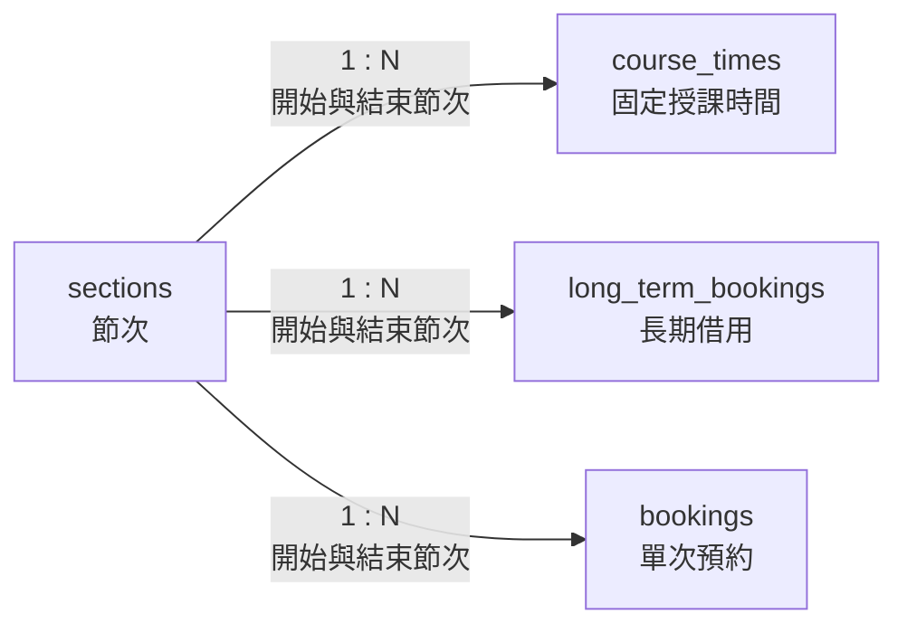

# 03. sections：節次

> [返回專案總覽](../專案總覽.md) | [返回實體索引](./README.md)

## 用途

保存學校定義的上課節次與起訖時間。其他實體只需參照節次編號，不必重複保存時間文字。

## 欄位表格

| 編號 | 欄位名稱 | 資料型別 | 必填 | 鍵值或參照 | 預設值 | 完整性限制 | 說明 |
|---|---|---|---|---|---|---|---|
| 1 | `section_id` | `TINYINT UNSIGNED` | 是 | PK | 無 | 主鍵不可重複、不可為空值 | 小範圍非負節次編號 |
| 2 | `section_name` | `CHAR(20)` | 是 | UK | 無 | `NOT NULL`、`UNIQUE` | 制度化節次名稱，例如 `第 1 節` |
| 3 | `start_time` | `TIME(0)` | 是 | - | 無 | `NOT NULL`、單日時間檢查 | 每日開始時刻，精確至秒，例如 `08:10:00` |
| 4 | `end_time` | `TIME(0)` | 是 | - | 無 | `NOT NULL`、單日時間檢查、`start_time < end_time` | 每日結束時刻，精確至秒 |

## 局部實體關聯圖



## 關聯實體

| 關聯實體 | 關聯類型 | 對方外鍵 | 說明 | 使用範例 |
|---|---|---|---|---|
| `course_times` | `sections` 1:N `course_times` | `start_section_id`、`end_section_id` → `sections.section_id` | 固定課表使用開始與結束節次 | 資料庫系統可設定由第 2 節開始、第 4 節結束。 |
| `long_term_bookings` | `sections` 1:N `long_term_bookings` | `start_section_id`、`end_section_id` → `sections.section_id` | 長期借用使用開始與結束節次 | 每週班會可固定借用第 5 至第 6 節。 |
| `bookings` | `sections` 1:N `bookings` | `start_section_id`、`end_section_id` → `sections.section_id` | 單次預約使用開始與結束節次 | 專題會議可申請第 5 至第 6 節。 |

## 其他邏輯規則

| 規則 | 說明 |
|---|---|
| 節次名稱唯一 | `section_name` 使用 `UNIQUE`，避免重複定義同名節次。 |
| 時間範圍 | `start_time` 必須早於 `end_time`。 |
| 預約節次範圍 | 參照本實體的固定課表、長期借用與單次預約，皆限制開始節次不可晚於結束節次。 |
| 時間格式 | `TIME(0)` 只保存 `HH:MM:SS` 時刻，不含日期、小數秒或時區。 |
| 單日範圍 | MariaDB `TIME` 可表示超過 24 小時的間隔，因此另以 `CHECK` 限制在 `00:00:00` 至 `23:59:59`。 |

## Domain 與對應 View

節次編號使用 `TINYINT UNSIGNED`；節次名稱為制度化短標籤，使用 `CHAR(20)`；起訖時刻使用秒級 `TIME(0)`。

```sql
SELECT * FROM vw_sections ORDER BY section_id;
SHOW CREATE VIEW vw_sections;
```
