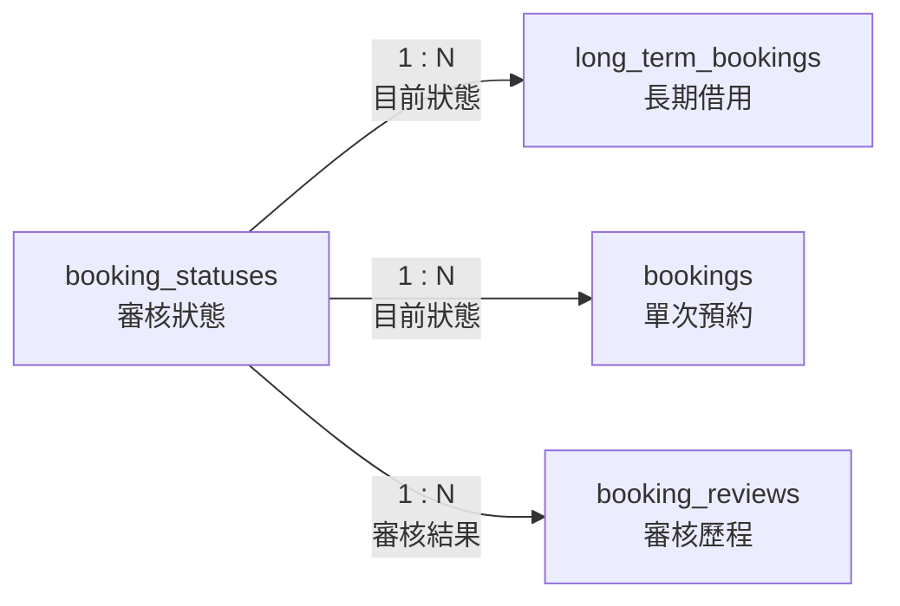

# 04. booking_statuses：審核狀態

> [返回專案總覽](../專案總覽.md) | [返回實體索引](./README.md)

## 用途

集中保存預約狀態，避免各交易資料表重複輸入不一致的狀態文字。

## 欄位表格

| 編號 | 欄位名稱 | 資料型別 | 必填 | 鍵值或參照 | 預設值 | 完整性限制 | 說明 |
|---|---|---|---|---|---|---|---|
| 1 | `status_id` | `TINYINT UNSIGNED` | 是 | PK | 無 | 主鍵不可重複、不可為空值 | 小範圍非負狀態識別碼 |
| 2 | `status_code` | `ENUM('pending','approved','rejected','canceled')` | 是 | UK | 無 | `NOT NULL`、`UNIQUE` | 程式使用的封閉狀態代碼 |
| 3 | `status_name` | `CHAR(20)` | 是 | - | 無 | `NOT NULL` | 制度化顯示名稱，例如待審核、已核准 |

## 局部實體關聯圖



## 關聯實體

| 關聯實體 | 關聯類型 | 對方外鍵 | 說明 | 使用範例 |
|---|---|---|---|---|
| `long_term_bookings` | `booking_statuses` 1:N `long_term_bookings` | `long_term_bookings.status_id` → `booking_statuses.status_id` | 長期借用保存目前狀態 | 多筆長期借用可同時處於 `pending`。 |
| `bookings` | `booking_statuses` 1:N `bookings` | `bookings.status_id` → `booking_statuses.status_id` | 單次預約保存目前狀態 | 管理員將預約由 `pending` 更新為 `approved`。 |
| `booking_reviews` | `booking_statuses` 1:N `booking_reviews` | `booking_reviews.status_id` → `booking_statuses.status_id` | 審核歷程保存每次審核結果 | 一筆審核歷程保存當次結果為 `rejected`。 |

## 其他邏輯規則

| 狀態代碼 | 中文意義 | 是否占用教室 | 說明 |
|---|---|---|---|
| `pending` | 待審核 | 否 | 可與其他待審核案件並存 |
| `approved` | 已核准 | 是 | Trigger 會檢查固定課表與其他已核准預約 |
| `rejected` | 已拒絕 | 否 | 不占用教室 |
| `canceled` | 已取消 | 否 | 不占用教室 |

`status_code` 使用 `ENUM` 與 `UNIQUE`，只能保存以上四種狀態代碼。

## Domain 與對應 View

狀態數量有限，因此主鍵使用 `TINYINT UNSIGNED`；機器代碼使用 `ENUM`，不以一般文字欄位接受任意值。

```sql
SELECT * FROM vw_booking_statuses ORDER BY status_id;
SHOW CREATE VIEW vw_booking_statuses;
```
