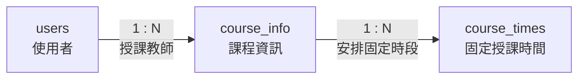

# 05. course_info：課程資訊

> [返回專案總覽](../專案總覽.md) | [返回實體索引](./README.md)

## 用途

保存每學期課程資料，包括學年度、學期、課程名稱與授課教師。

## 欄位表格

| 編號 | 欄位名稱 | 資料型別 | 必填 | 鍵值或參照 | 預設值 | 完整性限制 | 說明 |
|---|---|---|---|---|---|---|---|
| 1 | `course_id` | `VARCHAR(20)` | 是 | PK | 無 | 主鍵不可重複、不可為空值 | 課程識別碼 |
| 2 | `academic_year` | `INT` | 是 | - | 無 | `NOT NULL` | 學年度 |
| 3 | `semester` | `INT` | 是 | - | 無 | `NOT NULL`、`CHECK (semester IN (1, 2))` | 學期，只能為第 1 或第 2 學期 |
| 4 | `course_name` | `VARCHAR(100)` | 是 | - | 無 | `NOT NULL` | 課程名稱 |
| 5 | `teacher_id` | `CHAR(8)` | 是 | FK → `users.user_id` | 無 | `NOT NULL`、外鍵參照必須存在 | 授課教師 |

## 局部實體關聯圖

## 關聯實體

| 關聯實體 | 關聯類型 | 本實體外鍵或對方外鍵 | 說明 | 使用範例 |
|---|---|---|---|---|
| `users` | `users` 1:N `course_info` | `course_info.teacher_id` → `users.user_id` | 每門課程指定一位授課教師 | 資料庫系統課程指定教師 `T0000001`。 |
| `course_times` | `course_info` 1:N `course_times` | `course_times.course_id` → `course_info.course_id` | 一門課程得安排多個固定授課時段 | 資料庫系統可安排星期二與星期四兩筆固定授課時間。 |

## 其他邏輯規則

| 規則 | 說明 |
|---|---|
| 學期限制 | `semester` 只能為 `1` 或 `2`。 |
| 教師存在性 | `teacher_id` 必須對應至已存在的 `users.user_id`。 |
| 教師角色 | `teacher_id` 應對應角色為 `teacher` 的使用者。此角色符合性應由應用程式層執行驗證。 |
