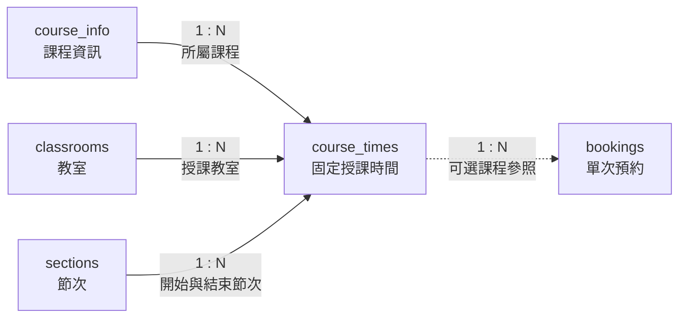

# 06. course_times：固定授課時間

> [返回專案總覽](../專案總覽.md) | [返回實體索引](./README.md)

## 用途

保存課程固定排課資訊，包括課程、教室、星期與節次範圍。

## 欄位表格

| 編號 | 欄位名稱 | 資料型別 | 必填 | 鍵值或參照 | 預設值 | 完整性限制 | 說明 |
|---|---|---|---|---|---|---|---|
| 1 | `course_time_id` | `BIGINT UNSIGNED` | 是 | PK | 自動編號 | `PRIMARY KEY AUTO_INCREMENT` | 長期累積的固定授課時間識別碼 |
| 2 | `course_id` | `CHAR(20)` | 是 | FK → `course_info.course_id` | 無 | `NOT NULL`、外鍵參照必須存在 | 所屬課程 |
| 3 | `classroom_id` | `CHAR(10)` | 是 | FK → `classrooms.classroom_id` | 無 | `NOT NULL`、外鍵參照必須存在 | 授課教室 |
| 4 | `day_of_week` | `TINYINT UNSIGNED` | 是 | - | 無 | `NOT NULL`、`CHECK (day_of_week BETWEEN 1 AND 7)` | 星期：`1` 為星期一，`7` 為星期日 |
| 5 | `start_section_id` | `TINYINT UNSIGNED` | 是 | FK → `sections.section_id` | 無 | `NOT NULL`、外鍵參照必須存在 | 開始節次 |
| 6 | `end_section_id` | `TINYINT UNSIGNED` | 是 | FK → `sections.section_id` | 無 | `NOT NULL`、外鍵參照必須存在、`CHECK (start_section_id <= end_section_id)` | 結束節次 |

## 局部實體關聯圖



## 關聯實體

| 關聯實體 | 關聯類型 | 本實體外鍵或對方外鍵 | 說明 | 使用範例 |
|---|---|---|---|---|
| `course_info` | `course_info` 1:N `course_times` | `course_times.course_id` → `course_info.course_id` | 每筆固定時段隸屬一門課程 | 課程 `CS-DB-001` 可具有星期二與星期四兩筆時段。 |
| `classrooms` | `classrooms` 1:N `course_times` | `course_times.classroom_id` → `classrooms.classroom_id` | 每筆固定時段使用一間教室 | 星期二的資料庫系統課程使用 `A101`。 |
| `sections` | `sections` 1:N `course_times` | `start_section_id`、`end_section_id` → `sections.section_id` | 每筆固定時段指定開始與結束節次 | 固定課表可指定第 2 至第 4 節。 |
| `bookings` | `course_times` 1:N `bookings` | `bookings.course_time_id` → `course_times.course_time_id` | 課程相關之額外借用得參照固定授課時間 | 課程考試之額外借用可連結原固定課表；一般借用可留空。 |

## 其他邏輯規則

| 規則 | 說明 |
|---|---|
| 星期範圍 | `day_of_week` 必須介於 `1` 至 `7`，`1` 為星期一，`7` 為星期日。 |
| 節次範圍 | `start_section_id` 不可大於 `end_section_id`。 |
| 固定課表衝突 | 同一教室、同一星期的固定課表不可發生節次重疊。 |
| 預約衝突 | 新增或修改固定課表時，不可與同一教室、相同星期、節次重疊的已核准預約衝突。 |
| 觸發器 | `trg_course_times_prevent_overlap_insert` 與 `trg_course_times_prevent_overlap_update` 負責執行衝突驗證。 |

## Domain 與對應 View

主鍵使用可長期累積的 `BIGINT UNSIGNED`；星期與節次均為小範圍非負整數，使用 `TINYINT UNSIGNED`；父鍵與外鍵使用完全相同的 `CHAR` Domain。

```sql
SELECT * FROM vw_course_times;
SHOW CREATE VIEW vw_course_times;
```

此 View 僅授權教師與管理員查詢。
