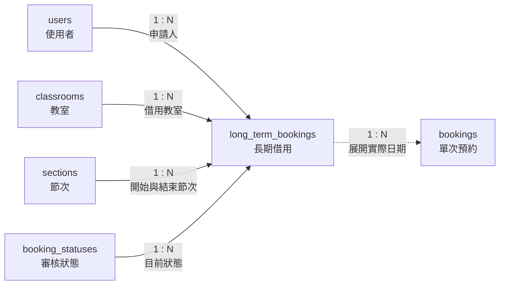

# 07. long_term_bookings：長期借用

> [返回專案總覽](../專案總覽.md) | [返回實體索引](./README.md)

## 用途

保存週期性借用計畫之父單據。例如專題小組於學期內每週二固定借用教室時，系統先建立一筆長期借用，再產生各日期之單次預約。

## 欄位表格

| 編號 | 欄位名稱 | 資料型別 | 必填 | 鍵值或參照 | 預設值 | 完整性限制 | 說明 |
|---|---|---|---|---|---|---|---|
| 1 | `long_term_id` | `INT` | 是 | PK | 自動編號 | `PRIMARY KEY AUTO_INCREMENT` | 長期借用識別碼 |
| 2 | `applicant_id` | `CHAR(8)` | 是 | FK → `users.user_id` | 無 | `NOT NULL`、外鍵參照必須存在 | 申請人 |
| 3 | `classroom_id` | `VARCHAR(10)` | 是 | FK → `classrooms.classroom_id` | 無 | `NOT NULL`、外鍵參照必須存在 | 借用教室 |
| 4 | `start_date` | `DATE` | 是 | - | 無 | `NOT NULL` | 借用開始日期 |
| 5 | `end_date` | `DATE` | 是 | - | 無 | `NOT NULL`、`CHECK (start_date <= end_date)` | 借用結束日期，不可早於開始日期 |
| 6 | `day_of_week` | `INT` | 是 | - | 無 | `NOT NULL`、`CHECK (day_of_week BETWEEN 1 AND 7)` | 每週借用日：`1` 為星期一，`7` 為星期日 |
| 7 | `start_section_id` | `INT` | 是 | FK → `sections.section_id` | 無 | `NOT NULL`、外鍵參照必須存在 | 開始節次 |
| 8 | `end_section_id` | `INT` | 是 | FK → `sections.section_id` | 無 | `NOT NULL`、外鍵參照必須存在、`CHECK (start_section_id <= end_section_id)` | 結束節次 |
| 9 | `reason` | `VARCHAR(200)` | 是 | - | 無 | `NOT NULL` | 借用原因 |
| 10 | `status_id` | `INT` | 是 | FK → `booking_statuses.status_id` | 無 | `NOT NULL`、外鍵參照必須存在 | 目前狀態 |
| 11 | `created_at` | `DATETIME` | 是 | - | `CURRENT_TIMESTAMP` | `NOT NULL` | 建立時間 |

## 局部實體關聯圖

## 關聯實體

| 關聯實體 | 關聯類型 | 本實體外鍵或對方外鍵 | 說明 | 使用範例 |
|---|---|---|---|---|
| `users` | `users` 1:N `long_term_bookings` | `applicant_id` → `users.user_id` | 每筆長期借用由一位使用者提出 | 學生 `41243149` 提出學期內每週會議借用。 |
| `classrooms` | `classrooms` 1:N `long_term_bookings` | `classroom_id` → `classrooms.classroom_id` | 每筆長期借用指定一間教室 | 每週會議固定借用 `B205`。 |
| `sections` | `sections` 1:N `long_term_bookings` | `start_section_id`、`end_section_id` → `sections.section_id` | 每筆長期借用指定開始與結束節次 | 每週會議固定使用第 5 至第 6 節。 |
| `booking_statuses` | `booking_statuses` 1:N `long_term_bookings` | `status_id` → `booking_statuses.status_id` | 每筆長期借用保存目前狀態 | 新申請先保存為 `pending`，核准後改為 `approved`。 |
| `bookings` | `long_term_bookings` 1:N `bookings` | `bookings.long_term_id` → `long_term_bookings.long_term_id` | 一筆長期借用可展開為多筆實際日期預約 | 每週二借用可展開為 `2026-06-09`、`2026-06-16` 等預約。 |

## 其他邏輯規則

| 規則 | 說明 |
|---|---|
| 日期範圍 | `start_date` 不可晚於 `end_date`。 |
| 星期範圍 | `day_of_week` 必須介於 `1` 至 `7`，`1` 為星期一，`7` 為星期日。 |
| 節次範圍 | `start_section_id` 不可大於 `end_section_id`。 |
| 展開規則 | 系統應依日期範圍與星期設定，將長期借用展開為多筆 `bookings`，讓每個實際日期都能接受衝突檢查。 |
| 衝突處理 | 展開後的每筆 `bookings` 在核准時都會依單次預約規則接受衝突檢查。 |
