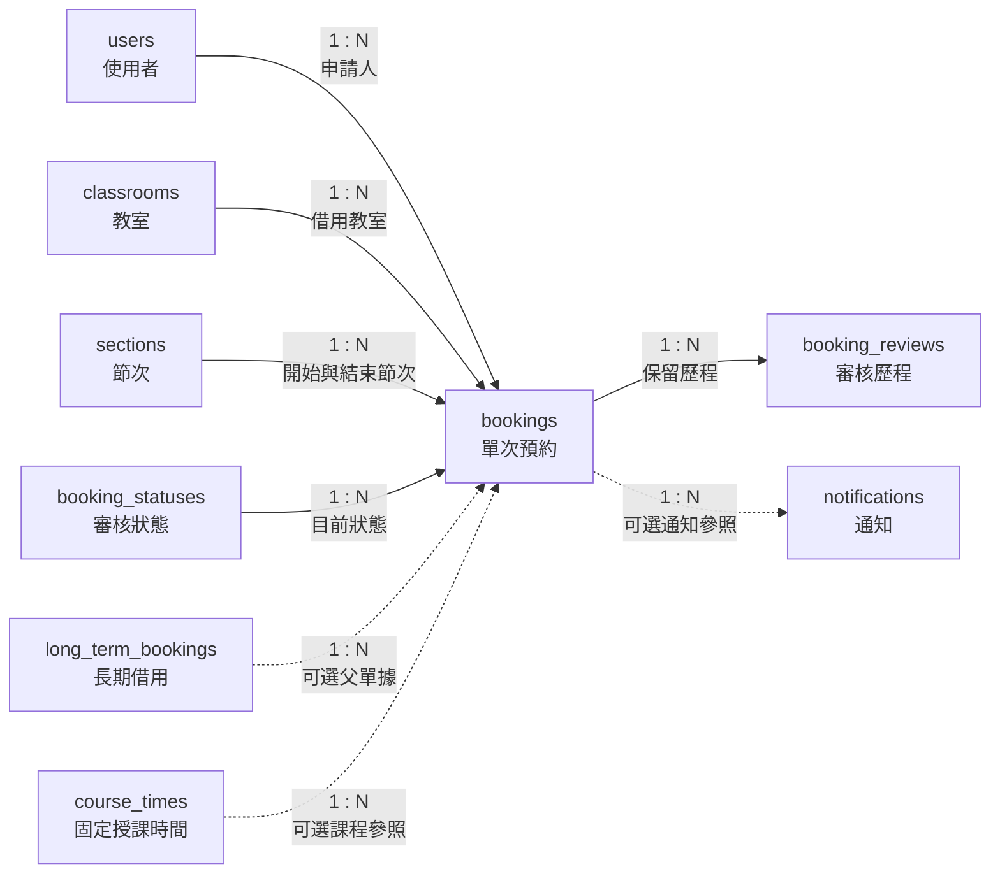

# 08. bookings：單次預約

> [返回專案總覽](../專案總覽.md) | [返回實體索引](./README.md)

## 用途

保存每一次實際發生的教室借用，是系統的營運核心。單次借用、長期借用展開後的日期，以及課程相關借用皆可記錄於此。

## 欄位表格

| 編號 | 欄位名稱 | 資料型別 | 必填 | 鍵值或參照 | 預設值 | 完整性限制 | 說明 |
|---|---|---|---|---|---|---|---|
| 1 | `booking_id` | `BIGINT UNSIGNED` | 是 | PK | 自動編號 | `PRIMARY KEY AUTO_INCREMENT` | 長期累積的單次預約識別碼 |
| 2 | `applicant_id` | `CHAR(8)` | 是 | FK → `users.user_id` | 無 | `NOT NULL`、外鍵參照必須存在 | 申請人 |
| 3 | `classroom_id` | `CHAR(10)` | 是 | FK → `classrooms.classroom_id` | 無 | `NOT NULL`、外鍵參照必須存在 | 借用教室 |
| 4 | `long_term_id` | `BIGINT UNSIGNED` | 否 | FK → `long_term_bookings.long_term_id` | `NULL` | 欄位具有值時，外鍵參照必須存在 | 對應長期借用；一般單次借用允許為空值 |
| 5 | `course_time_id` | `BIGINT UNSIGNED` | 否 | FK → `course_times.course_time_id` | `NULL` | 欄位具有值時，外鍵參照必須存在 | 對應固定課程；非課程借用允許為空值 |
| 6 | `booking_date` | `DATE` | 是 | - | 無 | `NOT NULL` | 實際使用的日曆日期，格式 `YYYY-MM-DD`，不含時刻與時區 |
| 7 | `start_section_id` | `TINYINT UNSIGNED` | 是 | FK → `sections.section_id` | 無 | `NOT NULL`、外鍵參照必須存在 | 開始節次 |
| 8 | `end_section_id` | `TINYINT UNSIGNED` | 是 | FK → `sections.section_id` | 無 | `NOT NULL`、外鍵參照必須存在、`CHECK (start_section_id <= end_section_id)` | 結束節次 |
| 9 | `reason` | `TEXT` | 是 | - | 無 | `NOT NULL` | 長度差異較大的借用原因 |
| 10 | `status_id` | `TINYINT UNSIGNED` | 是 | FK → `booking_statuses.status_id` | 無 | `NOT NULL`、外鍵參照必須存在 | 目前審核狀態 |
| 11 | `created_at` | `TIMESTAMP(6)` | 是 | - | `CURRENT_TIMESTAMP(6)` | `NOT NULL` | 建立事件時間，微秒精度，依連線時區轉換 |

## 局部實體關聯圖



## 關聯實體

| 關聯實體 | 關聯類型 | 本實體外鍵或對方外鍵 | 說明 | 使用範例 |
|---|---|---|---|---|
| `users` | `users` 1:N `bookings` | `applicant_id` → `users.user_id` | 每筆預約由一位使用者提出 | 學生 `41243149` 申請專題會議。 |
| `classrooms` | `classrooms` 1:N `bookings` | `classroom_id` → `classrooms.classroom_id` | 每筆預約指定一間教室 | 專題會議指定使用 `B205`。 |
| `long_term_bookings` | `long_term_bookings` 1:N `bookings` | `long_term_id` → `long_term_bookings.long_term_id` | 長期借用展開後之預約得參照父單據 | 週期性會議展開後，每筆日期預約參照同一父單據。 |
| `course_times` | `course_times` 1:N `bookings` | `course_time_id` → `course_times.course_time_id` | 課程相關借用得參照固定課表 | 課程考試借用可連結原固定授課時段。 |
| `sections` | `sections` 1:N `bookings` | `start_section_id`、`end_section_id` → `sections.section_id` | 每筆預約指定開始與結束節次 | 專題會議指定第 5 至第 6 節。 |
| `booking_statuses` | `booking_statuses` 1:N `bookings` | `status_id` → `booking_statuses.status_id` | 每筆預約保存目前狀態 | 新增申請時保存 `pending`，審核通過後更新為 `approved`。 |
| `booking_reviews` | `bookings` 1:N `booking_reviews` | `booking_reviews.booking_id` → `bookings.booking_id` | 一筆預約得保留多次審核歷程 | 預約可依序保存初次核准與後續取消紀錄。 |
| `notifications` | `bookings` 1:N `notifications` | `notifications.booking_id` → `bookings.booking_id` | 一筆預約得產生多則通知 | 預約核准與取消時各新增一則通知。 |

## 其他邏輯規則

| 規則 | 說明 |
|---|---|
| 節次範圍 | `start_section_id` 不可大於 `end_section_id`。 |
| 可選父單據 | 一般單次借用無須填寫 `long_term_id`；非課程借用無須填寫 `course_time_id`。 |
| 占用條件 | 只有狀態為 `approved` 的預約會占用教室。 |
| 待審核案件 | 多筆 `pending` 申請得暫時並存；管理員核准案件時，系統始執行最終衝突驗證。 |
| 固定課表衝突 | 新增或修改已核准預約時，不可與相同教室、日期所對應星期、節次重疊的固定課表衝突。 |
| 預約衝突 | 新增或修改已核准預約時，不可與相同教室、相同日期、節次重疊的其他已核准預約衝突。 |
| 觸發器 | `trg_bookings_prevent_overlap_insert` 與 `trg_bookings_prevent_overlap_update` 負責執行衝突驗證。 |
| 權限規則 | 學生與教師只能建立自己的 `pending` 預約，且只能修改或取消自己的待審核案件；管理員負責審核。 |

## Domain、時間型別與對應 View

`booking_date` 使用 `DATE`，只代表實際借用的日曆日期；實際時段由節次外鍵決定。`created_at` 使用 `TIMESTAMP(6)` 記錄事件瞬間。交易鍵使用 `BIGINT UNSIGNED`，原因使用 `TEXT`。

```sql
SELECT * FROM vw_bookings ORDER BY created_at DESC;
SHOW CREATE VIEW vw_bookings;
```

學生及教師僅能看見自己的預約，管理員可看見全部。
