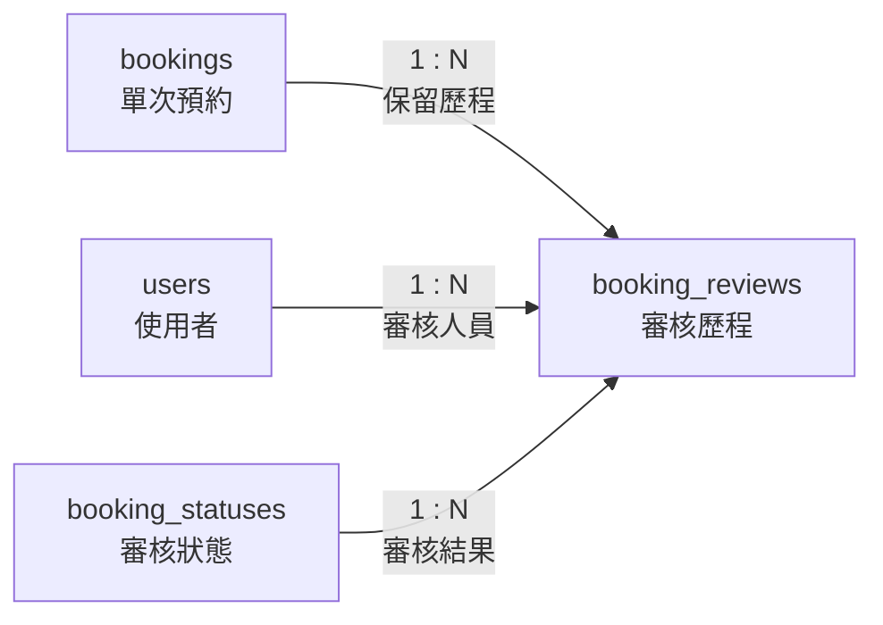

# 09. booking_reviews：審核歷程

> [返回專案總覽](../專案總覽.md) | [返回實體索引](./README.md)

## 用途

保存每次審核動作。除了 `bookings` 的目前狀態，系統也能追蹤審核人員、審核結果、意見與時間。

## 欄位表格

| 編號 | 欄位名稱 | 資料型別 | 必填 | 鍵值或參照 | 預設值 | 完整性限制 | 說明 |
|---|---|---|---|---|---|---|---|
| 1 | `review_id` | `INT` | 是 | PK | 自動編號 | `PRIMARY KEY AUTO_INCREMENT` | 審核紀錄識別碼 |
| 2 | `booking_id` | `INT` | 是 | FK → `bookings.booking_id` | 無 | `NOT NULL`、外鍵參照必須存在 | 被審核的單次預約 |
| 3 | `reviewer_id` | `CHAR(8)` | 是 | FK → `users.user_id` | 無 | `NOT NULL`、外鍵參照必須存在 | 審核人員 |
| 4 | `status_id` | `INT` | 是 | FK → `booking_statuses.status_id` | 無 | `NOT NULL`、外鍵參照必須存在 | 此次審核結果 |
| 5 | `comment` | `VARCHAR(300)` | 否 | - | `NULL` | 可為空值 | 審核備註 |
| 6 | `reviewed_at` | `DATETIME` | 是 | - | `CURRENT_TIMESTAMP` | `NOT NULL` | 審核時間 |

## 局部實體關聯圖

## 關聯實體

| 關聯實體 | 關聯類型 | 本實體外鍵 | 說明 | 使用範例 |
|---|---|---|---|---|
| `bookings` | `bookings` 1:N `booking_reviews` | `booking_id` → `bookings.booking_id` | 每筆審核歷程隸屬一筆單次預約 | 預約 `1` 可保存核准與後續取消兩筆歷程。 |
| `users` | `users` 1:N `booking_reviews` | `reviewer_id` → `users.user_id` | 每筆審核歷程由一位管理員建立 | 管理員 `A0000001` 建立核准紀錄。 |
| `booking_statuses` | `booking_statuses` 1:N `booking_reviews` | `status_id` → `booking_statuses.status_id` | 每筆審核歷程保存當次審核結果 | 核准紀錄參照 `approved` 狀態。 |

## 其他邏輯規則

| 規則 | 說明 |
|---|---|
| 審核角色 | `reviewer_id` 應對應角色為 `admin` 的使用者。此角色符合性應由應用程式層執行驗證。 |
| 歷程保存 | 每次狀態變更應新增一筆審核紀錄，不應覆蓋既有歷程。 |
| 備註欄位 | `comment` 允許為空值。管理員無須補充說明時，仍得完成審核。 |
| 審核時間 | `reviewed_at` 預設為新增紀錄時的 `CURRENT_TIMESTAMP`。 |
