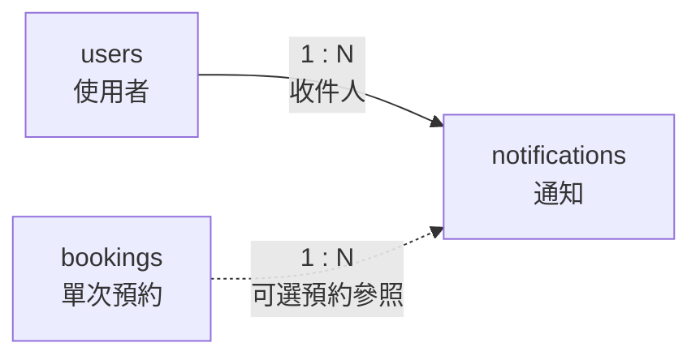

# 10. notifications：通知

> [返回專案總覽](../專案總覽.md) | [返回實體索引](./README.md)

## 用途

保存預約狀態通知與讀取狀態，供系統顯示使用者未讀取之訊息。

## 欄位表格

| 編號 | 欄位名稱 | 資料型別 | 必填 | 鍵值或參照 | 預設值 | 完整性限制 | 說明 |
|---|---|---|---|---|---|---|---|
| 1 | `notification_id` | `BIGINT UNSIGNED` | 是 | PK | 自動編號 | `PRIMARY KEY AUTO_INCREMENT` | 長期累積的通知識別碼 |
| 2 | `recipient_id` | `CHAR(8)` | 是 | FK → `users.user_id` | 無 | `NOT NULL`、外鍵參照必須存在 | 收件人 |
| 3 | `booking_id` | `BIGINT UNSIGNED` | 否 | FK → `bookings.booking_id` | `NULL` | 欄位具有值時，外鍵參照必須存在 | 對應預約；一般系統通知允許為空值 |
| 4 | `message` | `TEXT` | 是 | - | 無 | `NOT NULL` | 長度差異較大的通知內容 |
| 5 | `is_read` | `BOOLEAN` | 是 | - | `FALSE` | `NOT NULL`、布林值檢查 | `FALSE` 為未讀，`TRUE` 為已讀 |
| 6 | `created_at` | `TIMESTAMP(6)` | 是 | - | `CURRENT_TIMESTAMP(6)` | `NOT NULL` | 建立事件時間，微秒精度，依連線時區轉換 |

## 局部實體關聯圖



## 關聯實體

| 關聯實體 | 關聯類型 | 本實體外鍵 | 說明 | 使用範例 |
|---|---|---|---|---|
| `users` | `users` 1:N `notifications` | `recipient_id` → `users.user_id` | 每則通知寄送給一位使用者 | 學生 `41243149` 可收到多則借用結果通知。 |
| `bookings` | `bookings` 1:N `notifications` | `booking_id` → `bookings.booking_id` | 預約相關通知得連結至對應預約 | 預約核准通知連結預約 `1`；一般公告可不填寫。 |

## 其他邏輯規則

| 規則 | 說明 |
|---|---|
| 可選預約 | `booking_id` 允許為空值，以支援不屬於特定預約之一般系統通知。 |
| 讀取狀態 | `is_read` 使用 `BOOLEAN`，預設為 `FALSE`。 |
| 建立時間 | `created_at` 預設為新增通知時的 `CURRENT_TIMESTAMP(6)`。 |
| 查詢索引 | `idx_notifications_recipient_read` 可加速查詢指定使用者的未讀通知。 |

## Domain、時間型別與對應 View

通知內容使用 `TEXT`；讀取狀態使用 `BOOLEAN`；建立時間使用可依時區轉換的微秒級 `TIMESTAMP(6)`。

```sql
SELECT * FROM vw_notifications ORDER BY created_at DESC;
SHOW CREATE VIEW vw_notifications;
```

一般使用者僅能看見自己的通知，且只獲授權修改 `is_read`；管理員可管理全部。
